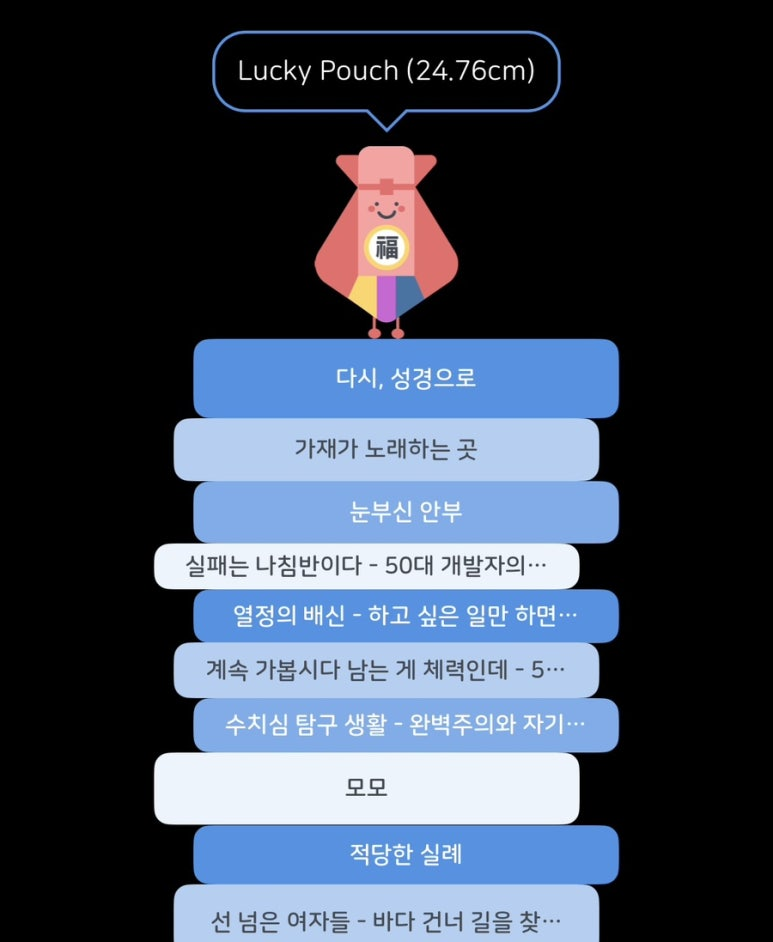

At the commencement of 2024, I resolved to compose a reading retrospective, and thus I present this reflection. (Though regrettably, the publication has extended into 2025...) A retrospective examination of the books one has perused throughout the year appears most befitting for an annual reflection. A year's accumulation of literary works constitutes an appropriate corpus, and even when the recollection of volumes read nearly a year prior has diminished, the act of revisiting the underlined passages and recorded contemplations proves itself a valuable temporal investment.

## Completed Works: 19 Volumes

Technical volumes requiring repeated consultation or serving as developmental references have been excluded from this enumeration. Thirteen works merited formal documentation owing to their exceptional quality.

### Works of Immersive Excellence That Compelled Sleep Deprivation

#### Beasts of a Little Land - Juhea Kim

A novel perused with deliberate intention during the holiday period as an alternative to streaming entertainment. This epic narrative traverses temporal boundaries from the Japanese colonial period through post-liberation, depicting characters from their childhood through either demise or senescence. Witnessing the melancholic departure of once-brilliant individuals and those who maintained their convictions until the end prompted profound reflection regarding my own position within the flowing currents of contemporary history and the nature of choices I would make therein.

#### Where the Crawdads Sing - Delia Owens

The narrative chronicles a young woman who comes to live in solitude within the marshlands. Profound and extensive knowledge regarding the marsh, natural world, and humanity interweaves intricately with the principal events. From the latter portion through the denouement, the work possesses an immersive quality that compels rapid consumption. The literary style exhibits an artistic sensibility, suggesting meticulous attention to each sentence.

### Works Meriting Repeated Consultation for Message Reinforcement

#### I Could Be Wrong, And So Could You - Björn Natthiko Lindeblad

The title itself constituted a profound message. For a considerable period, I frequently recalled and employed this concept for emotional regulation. The author's candid experiences as a "forest monk" vividly portray moments of enlightenment, rendering the work engaging. When I find myself unable to observe my own state and living frantically, or when suffering under circumstances beyond my control, I wish to revisit this volume.

#### The Subtle Art of Not Giving a F*ck - Mark Manson

A treatise on the art of effective abstraction in life. I encountered this work during a period when contemplating whether psychological counseling might prove necessary, and it assisted in transforming my mindset. (Reviewing the highlights has provided a sense of reset. I must read it again...) Messages such as "you are not special," "you are not entitled to constant happiness," and "never know thyself" initially appeared contrary to conventional wisdom, yet they were followed by explanations that immediately resonated, creating a sensation akin to receiving a necessary correction.

#### So Good They Can't Ignore You - Cal Newport

This volume also delivers considerable impact... When contemplating resignation to pursue "truly passionate work," one must revisit this work. It advises against such action. Rather than seeking the perfect occupation, it advocates for discovering the proper methodology for work. While the author acknowledges that the "craftsman mindset" cannot be applied to every profession, it proves particularly suited for software developers.

## Incomplete Works: 28 Volumes

The reasons for non-completion varied considerably. Some were excellent yet challenging, others contained sections that diminished interest, some were overshadowed by more engaging alternatives, and certain volumes were deliberately discontinued upon recognizing their conventional content. Occasionally, only specific sections appeared beneficial.

The advantage of subscription services such as Millie's Library lies in the facility to discontinue reading and commence alternative works when completion proves difficult. Works not perused beyond the first chapter have been excluded from this enumeration.

### Memorable Works Among Those Not Completed

#### Even When Crumpled, It's Still a Circle - Kim Chang-wan

Had this been composed in an arid style, the content might have appeared commonplace. However, the author expresses even minor daily occurrences and modest life wisdom with remarkable purity and freshness.

#### Do We Still Love Life - Erich Fromm

Numerous passages contain profound insights regarding contemporary society and humanity. Regarding concepts such as selfishness, creativity, anxiety, and love... Initial exposure to these sentences prompted the reaction "What? Defining it this way?" Yet upon contemplation, the observations appear fundamentally accurate.

## Reflection on Reading Practices

### Current Trends and Habits

- Electronic books have superseded physical volumes in frequency. While the tactile quality and aesthetic of physical books occasionally prove appealing, they present inconvenience during meals, and storage space has reached capacity. I utilize Kyobo eBook and Millie's Library. During periods when reading proves somewhat burdensome yet desired, I browse and add selections to my digital library.
- Upon commencing a volume and finding it meritorious, I register it as currently reading in the "Bookjuk Bookjuk" application.
- Following completion, I mark it as finished in "Bookjuk Bookjuk," and exceptional works are documented in Naver Blog posts with selective visibility.
- I practice parallel reading of multiple volumes.

### Positive Aspects

- While considerably distant from genuine bibliophiles, I have read more than double the previous year's volume.
- The application's continuous visualization of accumulated reading fostered a desire to complete works, bringing books into closer proximity and motivating completion.
- I cultivated enjoyment of literature and occasionally sought books for resolution of concerns.
- Exceptional works were documented and shared, albeit with a limited audience.

### Factors Inhibiting Increased Reading

- Smartphone distractions - messaging applications, social media, video platforms, et cetera
- When the desire to complete a work emerged yet text absorption proved difficult, progress often stagnated for several weeks. (Such periods typically coincided with minimal parallel reading...)
- On days of elevated stress or difficulty, opening a book proved challenging.
- When a quality book required substantial cognitive effort for proper comprehension, resuming that book proved difficult. (Particularly on weekdays)
- When parallel reading exceeded five volumes, completion probability decreased for all works except the most engaging.

### Objectives for 2025

- Increased reading volume - 36 completed works, 36 or more incomplete works
- Attempt unfamiliar genres including history, economics, and science, even if completion proves elusive
- Facilitate easier reading initiation through nudging - block social media applications and data during frequently disrupted periods. Implement daily 10-minute reading in diary tracking, and continually refine approaches...
- Increase contemplative notation during reading - place memo paper in frequent reading locations, utilize pinned iPhone notes
- Record 1-2 questions following each completion. Implement a documentation template
