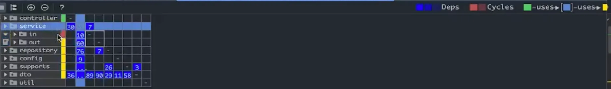

Over the past year and a half, I've been gradually improving a legacy system at my company. Queries containing business logic, tables composed of dozens of columns that look like random alphabets, complex code that requires careful examination to understand where to start making changes... I often had to confirm with team members if my understanding was correct, and I was never confident about modifying the code.

One of the reasons why it's difficult to easily touch the points we want to fix is the 'dependency' problem. If you want to modify B, but A, C, D... are using B in multiple places, modifying B becomes a challenging task. I want to briefly document the tools that helped analyze this dependency problem in the process of improving the architecture and the tools we used to make it into rules shared by the team. (We've made some improvements, but it's still ongoing)

## Module/Package Dependencies - Architecture Principles

Our team didn't establish strict and detailed architecture principles from the beginning. We generally improved incrementally through short refactoring cycles.

The most important thing, borrowing terms from the Clean Architecture book, was to separate policy from details. Business rules, policies, and parts that need to continuously evolve concepts are persistent and become core matters. Details are things like db, api, framework... that can easily change depending on technical decisions.

In the legacy system, classes closely related to policy were dependent on or tightly coupled with details, so technical decisions to change details forced too many code modifications. Important business rules were not distinguished and exposed, but treated as mere data, so refactoring work was needed to identify and separate these parts and organize them by repackaging according to our intentions.

## DSM: Understanding Module/Package Dependencies

When understanding dependencies between modules or packages, I used IntelliJ's DSM (Dependency Structure Matrix).

It displays dependencies between modules and packages in a matrix form, showing how they depend on each other and how many classes are dependent.

- How to run
    - IntelliJ action window (shift+command+A) → Select "Analyze Dependency Matrix..."
    - OR
    - Right-click on the module/package you want to analyze in IntelliJ > analyze > Select "Analyze Dependency Matrix..."

    


(Example - DSM screenshot)



- How to read
    - It looks complex, but following the legend in the example above:
        - The green package uses the selected light blue package. (controller —[uses]→ service)
        - The light blue package uses the yellow packages (service —[uses]—> repository, config, supports, dto)
        - There's a circular reference with the 'in' package in service. (indicated by brown or numbers above the diagonal from upper left to lower right indicate circular references...)
    - For a specific package, it's convenient to read column by column. You can check the number of packages that service depends on. Clicking expands it for more details.
    - At first, you might feel overwhelmed by the huge n x n matrix and find it difficult to read... If you don't understand, refer to this YouTube video for a more detailed explanation: https://www.youtube.com/watch?v=moi49_V_4g0

## ArchUnit: Making the Team (Including Me) Follow the Rules

While the team can agree to "let's do it this way" regarding architecture, it seems to easily break down during development. Even if you accidentally put a class in an unintended package, your code runs fine in the production environment.

[ArchUnit](https://www.archunit.org/) systematically enables the entire team to consistently follow design principles.

ArchUnit is a library that allows you to define and verify architecture rules based on Java code. Once you add the library dependency, you can add tests to your JUnit test code for "*whether the application adheres to architecture rules*". If you have an existing CI (Continuous Integration) pipeline that prevents git push or main branch merges when unit/integration tests fail, you can add ArchUnit tests to prevent code that violates architecture rules from being integrated.

### Examples of ArchUnit Rules I've Implemented

You can quickly understand by looking at examples. The library's syntax/DSL can be written like composing natural English sentences.

1. Adding rules for dao
    - Classes in the 'dao' package can only be accessed by classes in the 'service' and 'dao' packages. (service, dao → dao)
    - ⇒

```java
@ArchTest
@SuppressWarnings("unused")
public static final ArchRule daoRule = classes()
        .that().resideInAPackage("..dao..")
        .should().onlyBeAccessed().byAnyPackage("..services..", "..dao..", "..legacy..");
```

2. Adding rules for controller
    - Classes in the 'controller' package should only access classes in the 'usecases' or 'controller' packages. (controller → usecases, controller)
    - ⇒

    ```java
    @ArchTest
    @SuppressWarnings("unused")
    public static final ArchRule controllerRule = classes()
            .that().resideInAPackage("..controllers..")
            .should().accessClassesThat().resideInAPackage("..usecases..")
            .orShould().accessClassesThat().resideInAPackage("..controllers..");
    ```


### Other Use Cases

While writing this, I noticed it can also be used to enforce code conventions... I should try some things gradually while looking at example code repositories.

https://github.com/TNG/ArchUnit-Examples/tree/main/example-junit5/src/test/java/com/tngtech/archunit/exampletest/junit5

Once you add an ArchUnit test, it becomes a rule that all team members are forced to follow, so it's difficult to strictly apply many rules from the beginning. It's better to start with the most important rules and gradually increase them according to the level of agreement.

Even in the process of organizing packages for legacy code, it was difficult to move all the code to packages that conform to architecture rules at once. At some point, some code had moved while some remained. We gathered unorganized code separately and temporarily made exceptions in ArchUnit. We didn't have time to perfectly complete refactoring and repackaging. But rather than doing nothing, moving forward one step, sharing progress with the team, and documenting it as tests was meaningful work.

## References

- https://www.jetbrains.com/help/idea/dsm-analysis.html
- https://www.youtube.com/watch?v=moi49_V_4g0
- https://www.archunit.org
