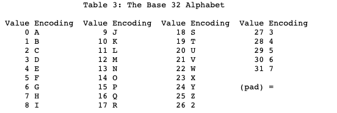
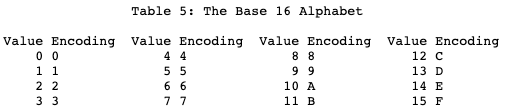
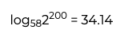

In the course of web development, one frequently encounters encoding schemes such as Base64. Until recently, I had merely conceptualized it as a standard for encoding binary data, but upon investigation, the subject proves remarkably intriguing. This exposition examines the fundamental nature of character encoding, the nomenclature conventions for base-N encoding systems, and the distinguishing characteristics among various standards including Base64, Base62, Base32, and Base16.

## Character Encoding

- Encoding constitutes the transformation of human-comprehensible data such as textual characters and visual representations into computational signals (sequences of 0 and 1).
- Character encoding specifically addresses the conversion of textual data into computational signals
- Representative character encoding methodologies:
    - ASCII (American Standard Code for Information Interchange)
        - The inaugural standard for textual representation in computing systems (established 1963)
        - Encompasses exclusively alphabetic characters and select special characters

        

    - Unicode
        - A comprehensive standard enabling consistent representation of all global writing systems within computational environments
        - Achieves unification of previously incompatible character encoding methodologies
        - UTF encoding and UCS encoding constitute transformation methodologies for Unicode, with UTF-8 representing one of the most prevalent implementations
- For comprehensive exposition regarding character encoding varieties and historical development, consult the [Wikipedia reference](https://en.wikipedia.org/wiki/Character_encoding)

## Binary-to-Text Encoding: Fundamental Concepts

- The process of encoding binary data into printable character strings
- Email systems exemplify principal applications, wherein the SMTP protocol transmits data through text-based mechanisms. The protocol specification mandates 7-bit ASCII transmission, whereas contemporary computational systems predominantly store data in 8-bit (byte) memory structures. Binary-to-text encoding becomes essential for lossless transmission of non-English languages utilizing more than 8 bits, as well as graphical, audio, and video content.

Let us examine the most prevalent binary-to-text encoding methodologies, proceeding from Base64 through Base32, Base16, Base62, and Base58.

## Base64

- Base-N denotes N-ary numeral systems; consequently, Base64 represents a sexagesimal (64-ary) system. This encoding methodology transforms 8-bit binary data into character strings composed exclusively of ASCII characters unaffected by character code variations. (Source: [Wikipedia](https://ko.wikipedia.org/wiki/%EB%B2%A0%EC%9D%B4%EC%8A%A464))
    - The proliferation of diverse character encoding standards (ISO-8859, Unicode, et cetera) arose from the necessity to accommodate global writing systems, yet each possesses distinct character coverage... Ultimately, representation independent of character codes necessitates conversion to ASCII.
    - The methodology partitions 24 bits (three 8-bit segments) into four 6-bit segments. (2^6 = 64)

    

    - Composition: A-Z, a-z, 0-9 (62 characters total) plus the symbols "+" and "/" = 64 characters (with "=" serving as a termination indicator)
        - Decimal: "1234567890"
        - Hexadecimal: "1234567890abcdef"
        - Sexagesimal: "ABCDEFGHIJKLMNOPQRSTUVWXYZabcdefghijklmnopqrstuvwxyz0123456789+/"
        - → Base64 represents the maximum radix expressible using printable ASCII characters (excluding control characters). The total printable ASCII character set comprises fewer than 128 characters.
    - However, the standard Base64 definition includes characters incompatible with URL specifications.
    - (Referencing [RFC 3986](https://datatracker.ietf.org/doc/html/rfc3986)): "+" and "/" constitute reserved characters
    - → "URL and Filename Safe" Base64 variant addresses this limitation (also defined in RFC documentation)
        - Substitutes "-" and "_" for "+" and "/"

### Base64 Encoding Methodology

- During conversion, data rarely aligns perfectly with 24-bit boundaries. Padding mechanisms accommodate this constraint.

- Vacant positions are populated with zeros, while entirely absent bit positions utilize the padding character "=".
- → Encoding results in approximately 4/3 size expansion relative to the original data.
- Note:
    - An octet comprises eight bits. While typically equivalent to one byte, early computing systems did not uniformly define bytes as 8-bit units; hence, the term "octet" was coined to unambiguously specify 8-bit groupings.

## Base32

- A 32-ary numeral representation. Employs 5-bit character set notation
- Advantages compared to Base64:
    - Beneficial for case-insensitive file systems, DNS nomenclature, and vocal communication
    - Excludes the Unix path separator ('/'), enabling usage in filenames
    - Avoids character pairs visually similar to humans (omits 1, 8, 0 which may be confused with I, B, O)
- Disadvantages compared to Base64:
    - Occupies 20% additional storage capacity

## Base16 (Hexadecimal)

- A 16-ary numeral representation
    - Converts 8-bit octets (1 byte) into two 4-bit characters (2 bytes)
- Advantages:
    - Most programming languages possess inherent functionality for parsing ASCII-encoded hexadecimal notation
    - Unlike Base32 and Base64, requires no padding (being precisely half of an 8-bit byte)
    - Hexadecimal notation enjoys widespread usage, enabling immediate comprehension without reference tables
- Disadvantages:
    - Space efficiency degrades to 50%

## Base62

- A variant of Base64 excluding special characters, comprising exclusively A-Z, a-z, 0-9
- Addresses scenarios necessitating special character substitution (URLs representing a prominent example)

## Base58Check

- A Base64 derivative eliminating visually ambiguous characters (0, O, I, l) and special symbols (+, /)
- Developed for Bitcoin address representation
    - Character disambiguation prevents Bitcoin accounts from appearing identical visually
    - Alphanumeric-only composition facilitates selection via double-clicking
    - Special characters in email contexts occasionally trigger line breaks
- Incorporates four bytes (32 bits) of SHA256-based error-checking code for invalid address detection
- Being non-power-of-two, proves more suitable for integer encoding than binary encoding
    - Bitcoin addresses constitute 25-byte (200-bit) numerals, representable as 35 characters in Base58
    

---

### References

- [https://datatracker.ietf.org/doc/html/rfc4648](https://datatracker.ietf.org/doc/html/rfc4648) ⭐
- [https://en.wikipedia.org/wiki/Base64](https://en.wikipedia.org/wiki/Base64)
- [https://hyoje420.tistory.com/1](https://hyoje420.tistory.com/1)
- [https://dokhakdubini.tistory.com/505](https://dokhakdubini.tistory.com/505)
- [https://www.johndcook.com/blog/2019/03/04/base-58-encoding-and-bitcoin-addresses/](https://www.johndcook.com/blog/2019/03/04/base-58-encoding-and-bitcoin-addresses/)
- [https://en.bitcoin.it/wiki/Base58Check_encoding](https://en.bitcoin.it/wiki/Base58Check_encoding)
