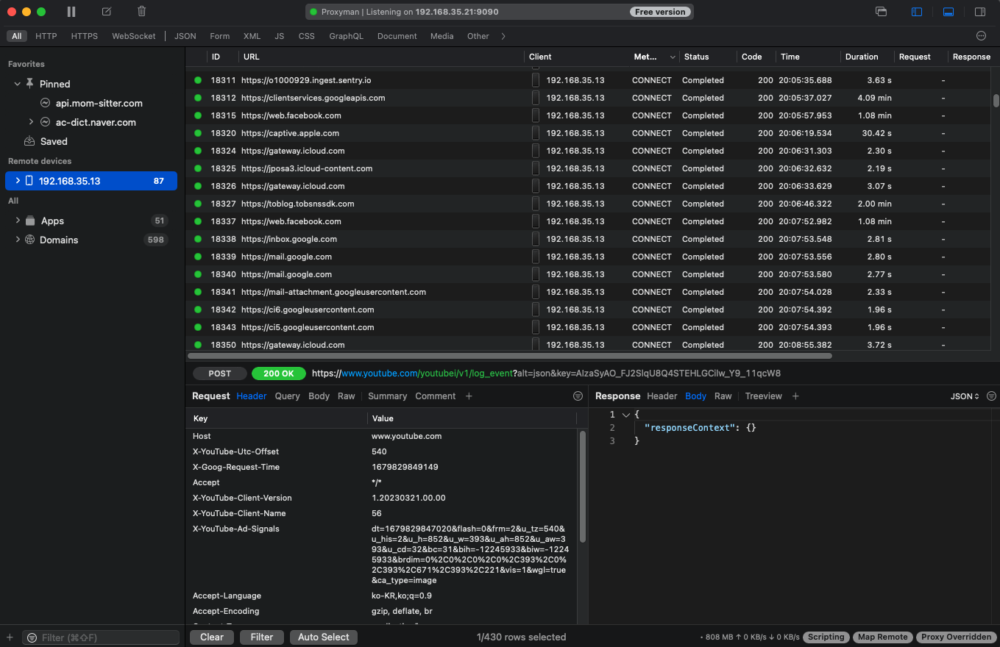
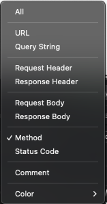
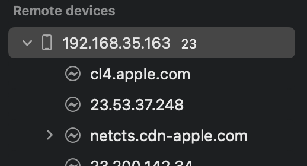
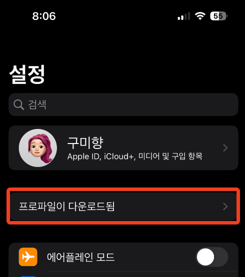
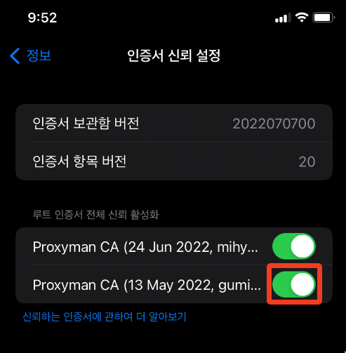

This article presents a comprehensive examination of the "Proxyman" tool. Introduced to me last year by developer Kai, it has proven invaluable for comprehending legacy systems and facilitating debugging operations. This guide explores the functionality, applicable scenarios, and implementation methodologies.

## Introduction to Proxyman

[https://proxyman.io/](https://proxyman.io/)

> Proxyman is a high-performance macOS app, which enables developers to view HTTP/HTTPS requests from apps and domains, including iOS devices, iOS Simulators, and Android devices.
>

Proxyman is a debugging tool that enables visualization of HTTP/HTTPS requests originating from applications and domains. It facilitates interception, examination, modification, and retransmission of HTTP/HTTPS requests on macOS, iOS, and Android devices.

- While primarily developed for macOS and iOS platforms, a Windows version is also available for download.
- Comparable tools: Fiddler, Charles Proxy, and similar applications exist.
    - Fiddler requires a paid subscription following a 10-day trial period (Fiddler Everywhere). Fiddler Classic compatibility with macOS could not be verified.
- Pricing structure: Download and limited utilization of fundamental features are available at no cost.
    - Adding devices or unlimited utilization of advanced features such as filtering and mapping requires the premium version ($69, $75.90 including tax - perpetual license). Currently utilizing the free tier, though the perpetual licensing model makes it potentially worth considering if usage frequency increases.

## Feature Set and Practical Application Scenarios

1. HTTP/HTTPS request and response examination
    - While web requests can be examined through browser developer tools, this functionality proves particularly valuable when analyzing requests originating from iOS device webviews or native applications.
    - Frequently encountered situations requiring identification of API endpoints to fix responses or behaviors on unfamiliar pages or legacy codebases. Since discovering this tool, I can readily access the necessary page after opening Proxyman and connecting to the configured WiFi network.
2. Map local / Map remote
    - Map remote is occasionally utilized for staging environment debugging (though this represents an extreme scenario).
        - Create and enable mapping rules: staging server endpoint → localhost
        - Launch local server in debug mode to debug invocations from staging web/app environments.
        

3. Diff verification → Employed when comparing API responses between development and production environments (accessible via the Diff option in the main menu).
4. Filter functionality → Valuable when isolating requests to specific servers.
5. API response modification capability - through scripting or the edit-and-repeat feature for modifying existing requests.
6. Compose functionality for directly constructing and transmitting requests → Postman tends to be preferred for this use case.

Numerous additional features are available.

### Practical Implementation Tips

- When numerous requests obscure the target request
    - Utilize the clear icon or pin/highlight features in the top toolbar.
    - Employ the filter functionality, which offers diverse filtering methodologies.

      

    - Example: To view only GET and POST requests while excluding CONNECT requests

      

## Configuration Methodology - Implementation Procedures

Device-specific setup instructions can be accessed through [Proxyman documentation](https://docs.proxyman.io/debug-devices/ios-device) or within the Proxyman application menu under 'Certificate' > 'Install Certificate on [device type]'. Following the provided guidance **precisely** facilitates rapid configuration.

(For webview debugging: Select 'Install Certificate on iOS' > 'Physical Devices..')

- Configuration difficulties → Likely indicates an omitted step or incorrect sequencing during setup.
    - Example: SSL handshake failure / WiFi HTTPS connection issues: Indicates improper certificate installation on the device

       

    - A minor but significant issue... I once failed to achieve connection despite following all manual procedures because the phone and MacBook were connected to similarly-named but different WiFi networks. ^^
- Upon successful mobile device connection, the Remote devices list appears on the left side, displaying connected devices.

   

- Certificate installation procedures may be unfamiliar; supplementary visual guidance is provided below.
    - After configuring WiFi proxy settings, a previously absent "Profile Downloaded" menu appears in Settings; select and install it.

    

    

    - Installation alone is insufficient; navigate to Settings > 'General' > 'About' > scroll to bottom > 'Certificate Trust Settings' and toggle root certificate activation to ON.

    
