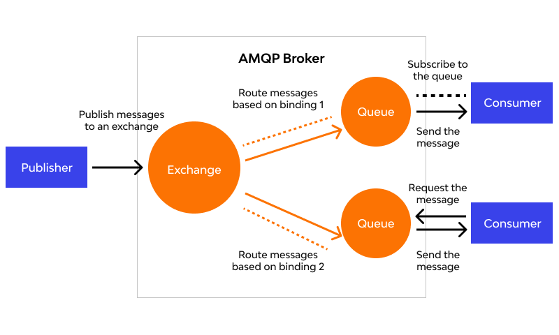

This article presents an examination of message queues, which are extensively utilized in distributed systems. As scenarios requiring their implementation in production environments are anticipated to increase, I have compiled considerations regarding when to contemplate message queue adoption and which technological implementations to employ among various alternatives.

## Fundamental Concepts

- A message queue is an asynchronous communication component that guarantees at-least-once delivery of messages, characterized by durability (the property that stored messages are safely retained until retrieval).
- The fundamental architecture comprises a producer (publisher) that generates messages and stores them in a queue, and a consumer/subscriber that retrieves messages from the queue and executes operations. The queue functions as a message buffer.

    

- Also referred to as a message broker.
- Producer and consumer relationships may be 1:1 or 1:N configurations.

### Comparison with Database Systems

- Most message queue implementations automatically delete messages upon successful delivery to consumers. They are not employed for long-term data persistence.
- Message queues assume processing of relatively small message volumes. Accumulation of excessive messages in the queue degrades overall throughput.

### Advantages

- Asynchronous processing
    - Producers can enqueue messages and proceed with other operations without awaiting responses.
- Data loss prevention (high reliability)
    - Direct communication protocols such as HTTP, commonly employed for producer-consumer communication, present message loss possibilities and assume both producer and consumer maintain online status. Server failure in either component introduces potential message loss.
    - Implementing queues facilitates straightforward handling of consumer server failures or disconnection states.
        - Queues do not delete undelivered or failed messages.
- High availability (HA) maintenance
- Fault tolerance: System design becomes possible where localized failures do not propagate throughout the entire system.
- Scalability
    - System components operate independently, facilitating the addition of servers or resources.

### Queue Mode versus Pub-Sub (Topic) Mode

- Queue
    - Messages are deleted from the queue once consumed.
    - Multiple consumers can listen to the same message queue based on load requirements.
- Pub/Sub
    - Messages are transmitted to **all** subscribers of a specific Topic without designating specific consumers.
    - Provides high scalability through loose coupling between senders and receivers.

### Primary Patterns for Multiple Consumer Message Reading in Pub-Sub Mode

1. Load Balancing
    - The broker arbitrarily designates one consumer to receive messages.
    - Valuable when message processing costs are expensive and parallelization through consumer addition is desired.
2. Fan-out
    - Messages are delivered to all consumers. Multiple independent consumers can receive and process identical messages without mutual interference.

## Optimal Utilization Scenarios

- Scenarios requiring loose coupling between systems
    - Operations such as "user registration" or "order placement" typically trigger multiple actions at the point of completion, including sending confirmation messages to users or issuing coupons.
    - Implementing message queues enables the server processing "user registration" or "orders" to function as the producer, while servers handling "notification transmission" and "coupon issuance" serve as consumers.
    - Synchronous REST API implementation: Would extend execution duration and introduce fault propagation issues, such as registration failure due to coupon issuance failure.
    - Message queue implementation: Messages can be enqueued without awaiting responses, enabling execution of other operations independent of "message transmission" or "coupon issuance" duration. Consumer server failures do not impact the producer server. Messages remain in the queue for retransmission upon consumer server recovery.
- Scenarios with traffic concentration during specific timeframes (service characteristics or first-come-first-served events)
    - Components generating significant traffic can be placed in message queues to function as buffers.
    - If the architecture permits consumer addition, the message queue can be scaled out and consumers added to increase throughput.
- When data volume to be processed significantly exceeds available resources
- When multiple applications must share a data repository

## Characteristics of Various Implementations

### **RabbitMQ**

- Implementation of AMQP (Advanced Message Queue Protocol).
- AMQP incorporates an exchange component functioning as a router. Demonstrates high efficiency when multiple consumers and queues exist.

    

    ([https://www.wallarm.com/what/what-is-amqp](https://www.wallarm.com/what/what-is-amqp))

- Four AMQP exchange types
    - Direct Exchange: Messages are load-balanced among consumers. Ideal for unicast.
    - Fanout Exchange: Routes messages to all bound queues. Ideal for message broadcasting.
    - Topic Exchange: Routes based on routing keys.
    - Headers Exchange: Routes messages by adding various attributes to message headers instead of routing keys.
- Supports clustering.

### **Amazon SQS (Simple Queue Service)**

- Processes messages via pull methodology. Does not support fan-out or message routing - a simple queue implementation.
- Message size limited to 256KB. Larger messages can be stored through integration with S3 and DynamoDB.
- Operational modes
    - Standard: Unlimited throughput. At-least-once message delivery (not guaranteed exactly once), best-effort-ordering (occasionally delivered in different order than sent).
    - FIFO: TPS limitations exist. Guarantees exactly-once message delivery and message ordering.
- Ensures reliability by sufficiently replicating messages across multiple servers. Messages may be received redundantly after a certain period following initial delivery.
- Robust security, ACL support (access control for messages to specific AWS accounts).
- DLQ (Dead Letter Queue)
    - DLQ configuration during SQS queue creation enables storage of messages that fail proper processing due to producer or consumer errors in a separate DLQ.

### Amazon SNS (Simple Notification Service)

- Supports user push/email notifications (Application to Person/A2P) and inter-application messaging (Application to Application/A2A).
- Fan-out methodology.
- A2A subscribers can include SQS, Lambda functions, HTTP/S endpoints, etc.
    - The configuration where SQS serves as a subscriber initially appeared peculiar. Initially, I questioned what scenarios would necessitate queue-to-queue transmission.
    - However, architectural patterns where SNS employs fan-out to distribute to multiple Lambda functions, SQS queues, etc., which then asynchronously execute respective roles, justify SQS implementation.
    - [https://seohyun0120.tistory.com/entry/AWS-SNS-vs-SQS-차이점](https://seohyun0120.tistory.com/entry/AWS-SNS-vs-SQS-%EC%B0%A8%EC%9D%B4%EC%A0%90) << This reference provided comprehension through examples.

### **Apache Kafka**

- Pub-sub model distributed message queue.
- High-volume message processing and real-time data processing.
- Stores messages on disk for configured retention periods → Enables message re-delivery to consumers upon error occurrence.
- High scalability.
- Not suitable when consumer message consumption order is critical.
- Reduced overhead through simple TCP-based protocol.

Numerous additional implementations exist, including Kinesis, ActiveMQ, Google Cloud Pub/Sub, etc., though comprehensive coverage would be impractical.

### Selection Criteria for Implementations

- Durability - Performance tradeoff
    - Message queue nodes may fail or become temporarily offline.
    - Achieving database-level durability requires disk writes or replica creation, incurring costs.
    - If message loss is acceptable, maintaining messages solely in memory increases throughput and reduces latency → RocketMQ, RabbitMQ (RAM node type configuration), ActiveMQ
    - If durability is paramount → Kafka, RabbitMQ (default configuration), SQS
        - (However, complete guarantee cannot be provided for scenarios where servers fail before disk transfer completion)

## References

- Concepts
    - [https://shortstories.gitbooks.io/studybook/content/message_queue_c815_b9ac.html](https://shortstories.gitbooks.io/studybook/content/message_queue_c815_b9ac.html)
    - Book: "System Design Interview – An insider's guide" Chapter 1
    - Book: "Designing Data-Intensive Applications" Chapter 11
- Use cases
    - Ridibooks Kafka [https://ridicorp.com/story/how-to-use-kafka-in-ridi/](https://ridicorp.com/story/how-to-use-kafka-in-ridi/)
    - Yanolja Redis & Kafka [https://techblog.gccompany.co.kr/redis-kafka를-활용한-선착순-쿠폰-이벤트-개발기-feat-네고왕-ec6682e39731](https://techblog.gccompany.co.kr/redis-kafka%EB%A5%BC-%ED%99%9C%EC%9A%A9%ED%95%9C-%EC%84%A0%EC%B0%A9%EC%88%9C-%EC%BF%A0%ED%8F%B0-%EC%9D%B4%EB%B2%A4%ED%8A%B8-%EA%B0%9C%EB%B0%9C%EA%B8%B0-feat-%EB%84%A4%EA%B3%A0%EC%99%95-ec6682e39731)
- Implementations
    - Serverless patterns [https://changhoi.kim/posts/serverless/serverless-architecture-pattern/](https://changhoi.kim/posts/serverless/serverless-architecture-pattern/)
    - AWS messaging services [https://jaemunbro.medium.com/aws-메시징서비스-비교-kinesis-sqs-sns-ab397a07cb1d](https://jaemunbro.medium.com/aws-%EB%A9%94%EC%8B%9C%EC%A7%95%EC%84%9C%EB%B9%84%EC%8A%A4-%EB%B9%84%EA%B5%90-kinesis-sqs-sns-ab397a07cb1d)
    - SQS [https://docs.aws.amazon.com/AWSSimpleQueueService/latest/SQSDeveloperGuide/welcome.html](https://docs.aws.amazon.com/AWSSimpleQueueService/latest/SQSDeveloperGuide/welcome.html)
    - SNS [https://docs.aws.amazon.com/ko_kr/sns/latest/dg/welcome-features.html](https://docs.aws.amazon.com/ko_kr/sns/latest/dg/welcome-features.html)
    - SNS and SQS [https://seohyun0120.tistory.com/entry/AWS-SNS-vs-SQS-차이점](https://seohyun0120.tistory.com/entry/AWS-SNS-vs-SQS-%EC%B0%A8%EC%9D%B4%EC%A0%90)
