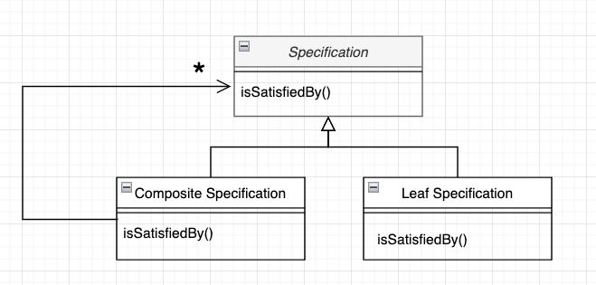

## intro

Following the previous article [specification pattern (1) concept and implementation](https://www.myanglog.com/specification%20pattern%20(1)%20%EA%B0%9C%EB%85%90%EA%B3%BC%20%EA%B5%AC%ED%98%84), I want to explore through specific examples in which situations this pattern is useful. I'll also introduce various implementation methods when applying the pattern to code.

## Use Cases for Specification

### 1. Validation

When validating an object to determine if it meets certain requirements or can be used for a specific purpose.

Examples:

- Invoice sending application: When an invoice is overdue → mark it in red
- Reservation application: When a product exceeds the limited quantity or the current time is before 2 PM → disable the reservation button

### 2. Selection

When selecting objects from a collection that satisfy specific conditions.

Examples:

- Invoice sending application: Select only overdue invoices from the list of invoices.
- Reservation application: For the purpose of displaying on the promotion list, select only event products within the reservable period.

### 3. Construction to Order

When specifying the creation of new objects that satisfy specific requirements. When creating or reconstructing new objects by explicitly setting creation rules for objects that don't yet exist.

Examples:

- Cargo shipping application: Create a schedule for transporting meat cargo using multiple routes from origin to destination.
- Chemical warehouse packing application: Create packaging that can contain chemicals that meet conditions such as explosive chemicals.

⇒ These three cases are not strictly separated. Depending on business requirements, a specification created for validation can be used for creation purposes for other features. Conceptually, they are the same in that they are rules about the domain. However, if you don't use specification, even though they are the same rule, they might be expressed in different implementation methods.

## Implementation: Once You've Found a Place to Use the Pattern

Let's try to use it in my code - if you've decided to do so, you can start with implementations that have lower costs, step by step. If it's clearly going to be used frequently, you could implement the full spec from the beginning, but that might not be easy when you're busy implementing requirements... 😇

### **1. Using Predicate**

In Java's case, you can implement similarly using Predicate, a functional interface similar to the Specification interface.

Predicate interface basic methods:

- `boolean test(T t)`

→ Can be used instead of `isSatisfiedBy`.

- `default Predicate<T> and(Predicate<? super T> other)`
- `default Predicate<T> or(Predicate<? super T> other)`
- `default Predicate<T> negate()`

→ Functions used when implementing specification as a composite are implemented as default methods, making them easy to use.

Example:

```java
Predicate<Customer> isSenior = customer -> customer.getAge() >= 60;
Predicate<Customer> isVip = Customer::isVip;
Predicate<Customer> isSeniorOrVip = isSenior.or(isVip);

/* client code */
if (isSeniorOrVip.test(customer1)) {
	// Logic to execute when condition is satisfied
}
```

You might think, "Why not just use this Predicate instead of implementing Specification?" but there are two disadvantages:

- Predicate is a general-purpose interface, making it difficult to express that it's a rule for domain objects.
- Predicates can only be combined with the methods implemented in Predicate, and it's difficult to extend.

### **2. Hardcoding Specification**

The easiest way you can implement a specification interface is to hardcode only the specs you need.

```java
interface StorageSpecification {
	boolean isSatisfiedBy(Container aContainer);
}
```

Example for validating a food storage warehouse:

- Condition: `Meat is stored in sanitary food containers at -4 degrees or below`

```java
public class MeatStorageSpecification implements StorageSpecification {
    @Override
    public boolean isSatisfiedBy(Container aContainer) {
        return aContainer.canMaintainTemperatureBelow(-4) && aContainer.isSanitaryForFood();
    }
}
```

⇒ Advantage: Easy and low cost

⇒ Disadvantage: Vulnerable to change

### **3. Creating Specification with Parameters**

Hardcoding is actually a bit too much... Let's add parameters to the Specification class.

- Condition: `Meat is stored in sanitary food containers at -4 degrees or below`
- The Specification class now has parameters and a more general name.

```java
public class CargoStorageSpecification implements StorageSpecification {
    private final int maxTemp;
    private final boolean isSanitaryForFood;

    public CargoStorageSpecification(int maxTemp, boolean isSanitaryForFood) {
        this.maxTemp = maxTemp;
        this.isSanitaryForFood = isSanitaryForFood;
    }

    @Override
    public boolean isSatisfiedBy(Container aContainer) {
        boolean tempCheck = aContainer.canMaintainTemperatureBelow(maxTemp);
        boolean sanitationCheck = isSanitaryForFood ? aContainer.isSanitaryForFood() : true;
        return tempCheck && sanitationCheck;
    }
}

/* specification creation code */
StorageSpecification meatStorage = new CargoStorageSpecification(4, true);
```

- ⇒ Advantage: More flexible condition setting compared to hardcoding.
- ⇒ Disadvantage: Still needs to be changed when different parameters are needed. Becomes complex as parameters are added.

### **4. Composite Specification**

This is the method introduced in the previous article. Create a specification class for each condition/constraint, and combine them using the composite pattern from design patterns.

#

  

.


```java
/** Create a Leaf Specification class for each condition **/
public class MaximumTemperatureSpecification implements Specification<Container> {
    private final int maxTemp;

    public MaximumTemperatureSpecification(int maxTemp) {
        this.maxTemp = maxTemp;
    }

    @Override
    public boolean isSatisfiedBy(Container container) {
        return container.canMaintainTemperatureBelow(maxTemp);
    }
}

public class SanitaryForFoodSpecification implements Specification<Container> {

    @Override
    public boolean isSatisfiedBy(Container container) {
        return container.isSanitaryForFood();
    }
}

/** Composite Specification contains leaves. **/
public class CompositeSpecification<T> implements Specification<T> {
    private final List<Specification<T>> components = new ArrayList<>();

    public CompositeSpecification<T> with(Specification<T> specification) {
        components.add(specification);
        return this;
    }

    @Override
    public boolean isSatisfiedBy(T candidate) {
        for (Specification<T> each : components) {
            if (!each.isSatisfiedBy(candidate)) {
                return false;
            }
        }
        return true; // Return true if all conditions are satisfied
    }
}
```

The above example returns true for `isSatisfiedBy` only when all conditions are satisfied.

More flexibly, specifications can be combined through other **logical operators**, such as returning true even if only one condition is satisfied.

```java
public abstract class Specification<T> {
    public abstract boolean isSatisfiedBy(T candidate);

    public Specification<T> and(Specification<T> other) {
		    // Returns true if all conditions are satisfied
        return new ConjunctionSpecification<>(this, other);
    }

    public Specification<T> or(Specification<T> other) {
		    // Here it returns true even if only one is satisfied
        return new DisjunctionSpecification<>(this, other);
    }
}
```

- ⇒ Advantage: Very flexible.
    - Now each specification has become a more general class.
    - Can be expressed using logical operators. (operations that can combine booleans like and, or, not)
- ⇒ Disadvantage: Cost of creating and combining specifications in a composite manner.

## Conclusion

Essentially, Specification is a pattern that separates the declaration of which objects to select from the object doing the selection. I think it's good to use when this **declarative and explicit definition** is needed, or when **constraints/requirements on objects** might make the role of the object less visible.

Especially when using composite specification, when requirements are added, you can use the method of adding new specifications instead of changing objects. This relates to object-oriented principles of SRP (there should be only one reason to change) and OCP (should be open for extension but closed for modification). If you want to try using it in implementation, you can start from the immediately needed requirements and gradually expand.

## References

- [Martin Fowler, Specification](https://www.martinfowler.com/apsupp/spec.pdf)
- [Eric Evans, 'Domain-Driven Design'](https://product.kyobobook.co.kr/detail/S000001514402)


- [Example code github](https://github.com/myangw/specification-example)
