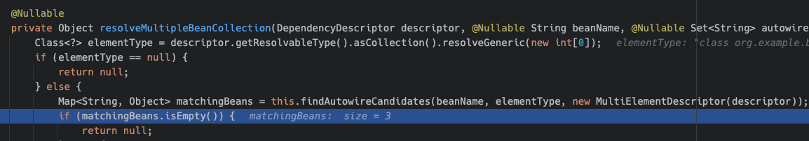

## intro
Although I use Spring regularly, I sometimes get confused with configurations in less familiar situations. Recently, while reviewing bean configurations in a project, I encountered a case where both a List type and the type of objects inside the List (for convenience, I'll refer to them as `List<T>` type and `T` type) were configured, as shown in the code below.

```java
  @Bean
  List<Cake> availableCakes() {
      return List.of(
          lemonCake(),
          chocolateCake(),
          strawberryCake()
      );
  }

  @Bean
  Cake chocolateCake() {
      return new Cake("Chocolate");
  }

  @Bean
  Cake strawberryCake() {
      return new Cake("Strawberry");
  }

  @Bean
  Cake lemonCake() {
      return new Cake("Lemon");
  }
```

Code that receives and uses `List<Cake>`:
```java
@Component
class Bakery {

    private final List<Cake> availableCakes;

    Bakery(List<Cake> availableCakes) {
        this.availableCakes = availableCakes;
    }
}
```

~~(I renamed the objects like this because I was craving cake..)~~

Originally, the order in which cakes were injected didn't matter, so this code was working fine. However, a new requirement was added that lemon cake must always be in the first position.

When I tested with the above code, contrary to what I expected, the first element (index 0..) of the cake list injected into Bakery was chocolate cake.

There are various ways to fix the order, and the deployment was successful, but I still had some lingering questions.
.
#

## Questions
1. When both `List<T>` type and `T` type are registered as beans, how exactly does it work?
2. How does it behave differently from when only `List<T>` is defined? (Why is `List<T>` ignored?)
3. What are the ways to explicitly specify the order?

#
### 1. When both `List<T>` type and `T` type are registered as beans, how exactly does it work?

One thing I had forgotten is that even if you don't declare `List<T>`, if there are beans of type `T`, they are injected into a List field.

During dependency injection, the Spring context finds all bean objects of the same type and injects them into the List.

```java
  @Bean
  Cake chocolateCake() {
      return new Cake("Chocolate");
  }

  @Bean
  Cake strawberryCake() {
      return new Cake("Strawberry");
}
```

After configuring beans as in the code above, the `List<Cake>` injected into Bakery below will include both chocolate and strawberry cakes.

```java
@Component
class Bakery {

    private final List<Cake> availableCakes;

    Bakery(List<Cake> availableCakes) {
        this.availableCakes = availableCakes;
    }
}
```

Hmm.. Then does it ignore the List type bean?? Why does it ignore it??

As I looked into it, I thought that if you're not careful (although you can catch it with good testing..), it could end up different from what you intended.

For example, if you write code like below,

```java
  @Bean
  List<Cake> availableCakes() {
      return List.of(
          lemonCake(),
          chocolateCake(),
          strawberryCake()
      );
  }

  @Bean
  Cake chocolateCake() {
      return new Cake("Chocolate");
  }

  @Bean
  Cake strawberryCake() {
      return new Cake("Strawberry");
  }

/** Assuming the bean annotation was accidentally omitted **/
  Cake lemonCake() {
      return new Cake("Lemon");
  }
```

⇒ Only the chocolate and strawberry cakes declared with `@Bean` are injected. ~~(Where did the lemon go?)~~

  

#

I was curious about how it works, so I put debug points in the Spring framework code to investigate. I started with both `List<Cake>` type and `Cake` type beans configured as in the code above.

** Spring version: 6.1.14

While searching, I found a class called `DefaultListableBeanFactory`, and after poking around, I discovered the `doResolveDependency` method that finds objects to inject. The name alone suggests it's related.
- This method calls `resolveMultipleBeans` in the same class, and `resolveMultipleBeanCollection` is called inside it.
- Looking inside `resolveMultipleBeanCollection`
- It finds matchingBeans for beanName ("bakery") by calling findAutowireCandidates().

  
  

** resolveMultipleBeanCollection code:
```java
@Nullable
private Object resolveMultipleBeanCollection(DependencyDescriptor descriptor, @Nullable String beanName, @Nullable Set<String> autowiredBeanNames, @Nullable TypeConverter typeConverter) {
    Class<?> elementType = descriptor.getResolvableType().asCollection().resolveGeneric(new int[0]);
    if (elementType == null) {
        return null;
    } else {
        Map<String, Object> matchingBeans = this.findAutowireCandidates(beanName, elementType, new MultiElementDescriptor(descriptor));
        if (matchingBeans.isEmpty()) {
            return null;
        } else {
            if (autowiredBeanNames != null) {
                autowiredBeanNames.addAll(matchingBeans.keySet());
            }

            TypeConverter converter = typeConverter != null ? typeConverter : this.getTypeConverter();
            Object result = converter.convertIfNecessary(matchingBeans.values(), descriptor.getDependencyType());
            if (result instanceof List) {
                List<?> list = (List)result;
                if (list.size() > 1) {
                    Comparator<Object> comparator = this.adaptDependencyComparator(matchingBeans);
                    if (comparator != null) {
                        list.sort(comparator);
                    }
                }
            }

            return result;
        }
}
```


- Returning to the initially called point, `doResolveDependency` returns this immediately because it found the bean to inject.

```java
Object multipleBeans = this.resolveMultipleBeans(descriptor, beanName, autowiredBeanNames, typeConverter);
if (multipleBeans != null) {
    Object var26 = multipleBeans;
    return var26; // Return!
}
```


#

### 2. How does it behave differently from when only the `List<T>` type bean is defined?

I checked the same part after setting only List as a bean.

(`doResolveDependency` > `resolveMultipleBeans` > `resolveMultipleBeanCollection` )

In `resolveMultipleBeanCollection`, it checks what type the element inside the List is and finds the element's type.

```java
private Object resolveMultipleBeanCollection(DependencyDescriptor descriptor, @Nullable String beanName, @Nullable Set<String> autowiredBeanNames, @Nullable TypeConverter typeConverter) {
  Class<?> elementType = descriptor.getResolvableType().asCollection().resolveGeneric(new int[0]);
```

- When calling the `this.findAutowireCandidates` method later, the elementType argument becomes `Cake.class`.
    - However, since this time only the List type bean was configured, this method doesn't find a bean and ends.

What happens next is

- Returning to `doResolveDependency`, it calls findAutowireCandidates again, but this time it passes List to type.
`Map<String, Object> matchingBeans = this.findAutowireCandidates(beanName, type, descriptor);`
- This time, since there is a List type bean, `availableCakes` is contained in matchingBeans.
- The entire `doResolveDependency` code is too long, so I've attached it at the bottom of this post.


#
⇒ Summarizing what I've seen so far

- When a field that needs injection is a List type in Spring code,
    - First, it looks for element objects inside the List.
        - if found → Return as is. (Doesn't look for List type separately)
        - if not found → Find and return List type bean.


#

### 3. What are the ways to explicitly specify the order?

1. Reconsider whether each object included in the List must be a bean. If not, just define only the List type as a bean, and it will be injected in the order you put them in the list.

    ```java
        @Bean
        List<Cake> availableCakes() {
            return List.of(
                lemonCake(),
                chocolateCake(),
                strawberryCake()
            );
        }

    //    @Bean
        Cake chocolateCake() {
            return new Cake("Chocolate");
        }

    //    @Bean
        Cake strawberryCake() {
            return new Cake("Strawberry");
        }

    //    @Bean
        Cake lemonCake() {
            return new Cake("Lemon");
        }
    ```

    - ⇒ Result
    ```java
    @Test
    void test1() {
        List<Cake> actual = sut.getAvailableCakes();

        assertThat(actual).hasSize(3);
        assertThat(actual.get(0).getMainIngredient()).isEqualTo("Lemon");
        assertThat(actual.get(1).getMainIngredient()).isEqualTo("Chocolate");
        assertThat(actual.get(2).getMainIngredient()).isEqualTo("Strawberry");
    }
    // => Passes.
    ```

2. Using `@Order`
- By default, beans are sorted according to scan order, but when you sort using `@Order`
- Bean order is sorted according to the specified `@Order` value.

```java
    @Bean
    @Order(2)
    Cake chocolateCake() {
        return new Cake("Chocolate");
    }

    @Bean
    @Order(1)
    Cake strawberryCake() {
        return new Cake("Strawberry");
    }
```

⇒ Result
```java
@Test
void test1() {
    List<Cake> actual = sut.getAvailableCakes();

    assertThat(actual).hasSize(2);
    assertThat(actual.get(0).getMainIngredient()).isEqualTo("Strawberry");
    assertThat(actual.get(1).getMainIngredient()).isEqualTo("Chocolate");
}
// => Passes.
```


This is a method described in the Spring documentation and it's convenient because you just need to attach @Order, but the downside is that you can only know the entire order by checking each bean method.. It could be difficult for future me / other team members.

#

3. Creating a Composite

If there's room to modify the object receiving the injection (Bakery in this example), you can have it receive Cake instead of a List type, then create a Composite Cake. (The Composite object handles the list)

```java
@Component
class Bakery {
    private final Cake availableCake;

    Bakery(Cake cake) {
        this.availableCake = cake;
    }
}
```

```java
@Bean
@Primary
Cake cakeComposite(
     Cake lemonCake,
     Cake chocolateCake,
     Cake strawberryCake
) {
    List<Cake> cakes = new ArrayList<>();
    cakes.add(lemonCake);
    cakes.add(chocolateCake);
    cakes.add(strawberryCake);
    return new CakeComposite(cakes);
}

@Bean
Cake chocolateCake() {
    return new Cake("Chocolate");
}

@Bean
Cake strawberryCake() {
    return new Cake("Strawberry");
}

@Bean
Cake lemonCake() {
    return new Cake("Lemon");
}
```

#
Before considering which method to choose, we should fundamentally think about why we need to specify the order here, and whether there's another way to solve it more simply. ///


#


** Reference:  doResolveDependency() full code

```java
@Nullable
public Object doResolveDependency(DependencyDescriptor descriptor, @Nullable String beanName, @Nullable Set<String> autowiredBeanNames, @Nullable TypeConverter typeConverter) throws BeansException {
    InjectionPoint previousInjectionPoint = ConstructorResolver.setCurrentInjectionPoint(descriptor);

    Object type;
    try {
        Object shortcut = descriptor.resolveShortcut(this);
        if (shortcut == null) {
            Class<?> type = descriptor.getDependencyType();
            Object value = this.getAutowireCandidateResolver().getSuggestedValue(descriptor);
            if (value == null) {
                Object multipleBeans = this.resolveMultipleBeans(descriptor, beanName, autowiredBeanNames, typeConverter);
                if (multipleBeans != null) {
                    Object var26 = multipleBeans;
                    return var26;
                }

                Map<String, Object> matchingBeans = this.findAutowireCandidates(beanName, type, descriptor);
                if (!matchingBeans.isEmpty()) {
                    Object instanceCandidate;
                    String autowiredBeanName;
                    if (matchingBeans.size() > 1) {
                        autowiredBeanName = this.determineAutowireCandidate(matchingBeans, descriptor);
                        if (autowiredBeanName == null) {
                            if (!this.isRequired(descriptor) && this.indicatesArrayCollectionOrMap(type)) {
                                Object var31 = null;
                                return var31;
                            }

                            Object result = descriptor.resolveNotUnique(descriptor.getResolvableType(), matchingBeans);
                            return result;
                        }

                        instanceCandidate = matchingBeans.get(autowiredBeanName);
                    } else {
                        Map.Entry<String, Object> entry = (Map.Entry)matchingBeans.entrySet().iterator().next();
                        autowiredBeanName = (String)entry.getKey();
                        instanceCandidate = entry.getValue();
                    }

                    if (autowiredBeanNames != null) {
                        autowiredBeanNames.add(autowiredBeanName);
                    }

                    if (instanceCandidate instanceof Class) {
                        instanceCandidate = descriptor.resolveCandidate(autowiredBeanName, type, this);
                    }

                    Object result = instanceCandidate;
                    if (instanceCandidate instanceof NullBean) {
                        if (this.isRequired(descriptor)) {
                            this.raiseNoMatchingBeanFound(type, descriptor.getResolvableType(), descriptor);
                        }

                        result = null;
                    }

                    if (!ClassUtils.isAssignableValue(type, result)) {
                        throw new BeanNotOfRequiredTypeException(autowiredBeanName, type, instanceCandidate.getClass());
                    }

                    Object var14 = result;
                    return var14;
                }

                multipleBeans = this.resolveMultipleBeansFallback(descriptor, beanName, autowiredBeanNames, typeConverter);
                if (multipleBeans != null) {
                    Object var29 = multipleBeans;
                    return var29;
                }

                if (this.isRequired(descriptor)) {
                    this.raiseNoMatchingBeanFound(type, descriptor.getResolvableType(), descriptor);
                }

                Object var28 = null;
                return var28;
            }

            if (value instanceof String) {
                String strValue = (String)value;
                String resolvedValue = this.resolveEmbeddedValue(strValue);
                BeanDefinition bd = beanName != null && this.containsBean(beanName) ? this.getMergedBeanDefinition(beanName) : null;
                value = this.evaluateBeanDefinitionString(resolvedValue, bd);
            }

            TypeConverter converter = typeConverter != null ? typeConverter : this.getTypeConverter();

            try {
                Object var24 = converter.convertIfNecessary(value, type, descriptor.getTypeDescriptor());
                return var24;
            } catch (UnsupportedOperationException var18) {
                Object var27 = descriptor.getField() != null ? converter.convertIfNecessary(value, type, descriptor.getField()) : converter.convertIfNecessary(value, type, descriptor.getMethodParameter());
                return var27;
            }
        }

        type = shortcut;
    } finally {
        ConstructorResolver.setCurrentInjectionPoint(previousInjectionPoint);
    }

    return type;
}
```
