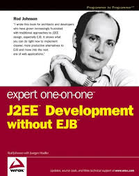
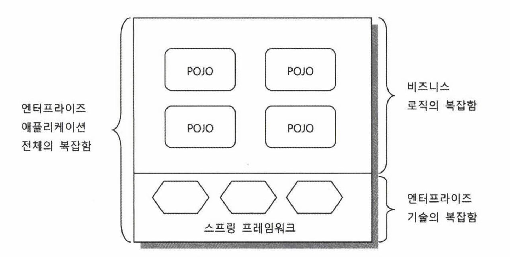

## 8.1 Spring's Definition

An open-source lightweight application framework facilitating Java enterprise development

- **Application Framework**
  - Unlike libraries/frameworks specialized for specific domains or technologies
  - Application frameworks encompass entire application scope comprehensively
  - Spring originated from Rod Johnson's J2EE technical book example code
    - The book addressed design and development strategies across all J2EE application tiers
    - Spring was developed incorporating core strategies for Java enterprise development across all tiers

    

- **Lightweight**
  - Not heavy - Contrary to excessive engineering in technologies like EJB
  - Spring operates on simplest server environments (Tomcat, Jetty)
  - Code remains comparatively compact and simple

- **Facilitating Java Enterprise Development**
  - Spring fundamentally removes enterprise development complexity, genuinely facilitating development
  - EJB shared identical objectives but introduced greater complexity during pursuit
  - Convenient application development: Developers dedicate minimal attention to complex, error-prone low-level technologies while rapidly, effectively implementing application core business logic
  - Spring enables developers to focus more on application logic than framework technology

- **Open Source**
  - Apache License 2.0: Commercial product inclusion permitted without modification disclosure obligation
  - Advantages: Transparent, diverse participation enabling rapid, flexible development
  - Disadvantages: Uncertain continuous, stable development sustainability
  - Spring combines open-source development with SpringSource enterprise-managed official development

## 8.2 Spring's Objectives

Understanding objectives and utilizing as appropriate tools yields genuine value.

### Enterprise Development Complexity

1. Increasing technical constraints and requirements
   - Handle numerous concurrent user requests with critical information/systems → Performance, security, stability, scalability considerations
2. Business logic complexity increases
   - Rapid business evolution → Frequent requirement and policy modifications
3. Complexities 1 and 2 intertwine

### Addressing Complexity

- Failed solution: EJB (forced technology and specification dependency)
- Effective solution: Spring (non-invasive approach)
  - **Non-invasive technology**: Technology application facts do not directly appear in code. Perform only necessary technology-application work without restricting code design and implementation

### Spring's Strategies Against Complexity

1. **Addressing Technical Complexity**
   - Problem 1: Inconsistent technology access approaches, environment-specific dependencies
     - ⇒ Service abstraction
       - Examples: Transaction abstraction, OXM abstraction, consistent exception translation for data access
   - Problem 2: Technical processing code intermixed with different-natured code
     - ⇒ AOP
       - Examples: Transactions, security, logging, auditing
       - Cleanly separate technical code into independent modules

2. **Addressing Business/Application Logic Complexity**
   - Frequently modified, error criticality
   - Contemporary: Business logic resides within applications. Scalable, testable. Well-utilized object-oriented Java language enables effective business logic implementation
   - Spring's non-invasive nature facilitates object-oriented programming by removing impediments

3. **Common Tool for Both Complexities: Object-Orientation and DI**
   - Spring's motto: 'Back to basics' - Facilitate superior object-oriented design structure application through convenient DI technology
   - Service abstraction, template/callback, AOP all based on DI
   - DI: Not special technology but programming technique emerging from flexible, extensible object-oriented design, subsequently guiding toward more object-oriented design and development

## 8.3 POJO Programming

"Provide enterprise service technologies necessary yet separate from POJO-style developed application core logic"

- Spring application = Application code using POJOs + Design information defining POJO relationships and operations
- IoC/DI, AOP, PSA (Portable Service Abstraction) constitute enabling technologies for POJO application development

### POJO Definition

Plain Old Java Object. Martin Fowler coined the term questioning why simple Java objects receive insufficient utilization. Answer: Lack of impressive nomenclature like EJB... Hence POJO creation

### POJO Conditions

1. Not dependent on specific conventions
   - Should depend exclusively on Java language and essential APIs ↔ EJB or Struts requiring specific class inheritance
2. Not dependent on specific environments
   - ↔ Code directly invoking OS-specific functionality or WebLogic server-exclusive APIs
   - POJO classes containing business logic should not utilize web environment information or web technology classes/interfaces
     - Even when eventual web controller connection proves inevitable, direct web environment limitation impairs alternative client usage and independent testing
3. Faithful to object-oriented Java language fundamentals
   - ↔ Consolidating code with different responsibilities/roles into single classes, strong coupling with other layer code

⇒ Genuine POJOs: Objects designed for reusability according to object-oriented principles, independent of environment and technology. POJO programming: Designing and developing with application core logic and functionality in such POJOs

### POJO Advantages

POJO qualification conditions directly constitute POJO advantages - Clean code, object-oriented design freedom

### POJO Framework

Spring intervenes exclusively in technical domains, concealing itself from business logic POJOs. Minimal data access and web UI involvement.

## 8.4 Spring's Technologies

Three enabling technologies for effortless POJO programming: IoC/DI, AOP, PSA

### IoC/DI

- **DI Rationale**: Enable flexible extension. OCP (Open-Closed Principle)

- **Concrete DI Applications**:
  - Core functionality modification
  - Core functionality dynamic modification
  - Additional functionality supplementation
  - Interface modification
  - Proxies
  - Templates and callbacks
  - Singleton and object scopes
  - Testing

### AOP

While IoC/DI techniques enable POJO programming generally, certain services prove difficult to apply maintaining POJO conditions through pure object-oriented techniques alone. ⇒ AOP necessity

- **AOP Application Techniques**:
  1. Dynamic proxy usage (Spring approach)
     - Decorator pattern application. Simple and convenient, but additional functionality limited to method invocation points
  2. Language extension beyond Java language limitations
     - AspectJ usage - Enables additional functionality beyond method invocations
     - Requires separate AOP compiler builds or bytecode manipulation during class memory loading

- **AOP Application Stages**: Gradually introduce to avoid confusion
  1. Utilize pre-prepared AOP
  2. Policy AOP application through dedicated teams
  3. Liberal AOP utilization

### PSA (Portable Service Abstraction)

- Transactions combine with AOP, eliminating direct service abstraction necessity
- OXM, JavaMail utilization: Write code using Spring-defined abstract APIs, specify concrete technologies and settings via XML
- Even when Spring excludes service abstraction targets, introduce abstract layers directly, define consistent APIs. Service abstraction requires exclusively DI
- Apply service abstraction for APIs with difficult testing or external-controlled configuration requirements
