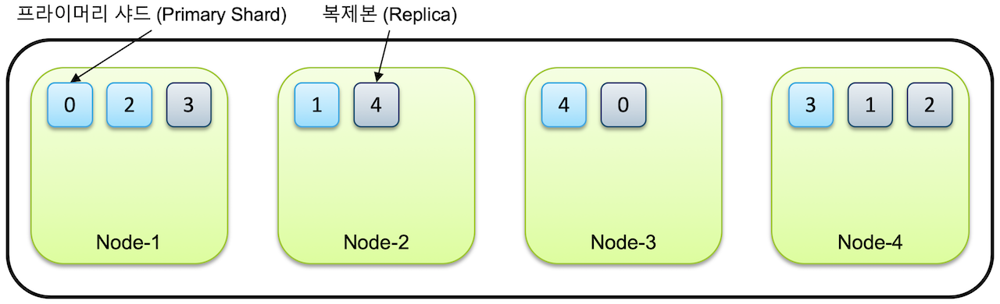

When investigating methodologies for enhancing Elasticsearch indexing performance, one frequently encounters the recommendation to configure the refresh interval parameter to -1. Consequently, during the initial development phase, I established this configuration within the template settings. However, upon attempting to verify the data, an issue manifested wherein newly indexed documents remained invisible in search results. This occurred because setting the refresh interval to -1 effectively disables the refresh operation. (I should have consulted the documentation more thoroughly... [Elastic's guide on indexing performance optimization](https://www.elastic.co/guide/en/elasticsearch/reference/current/tune-for-indexing-speed.html)) This prompted a comprehensive investigation into the internal storage mechanisms, the conceptual foundation of the refresh operation, and the underlying reasons for search invisibility.

## Fundamental Architecture

An Elasticsearch application enables the aggregation of multiple nodes into a unified cluster. The recommended practice involves executing a single node per physical server.

A single index is distributed across multiple shards, which are themselves dispersed across distinct nodes. When replica configuration specifies one or more replicas, these replicas are positioned on separate nodes from the primary shards.

(Source: https://esbook.kimjmin.net/03-cluster/3.2-index-and-shards)

## Document Modification, Deletion, and Addition Operations

Elasticsearch constitutes a Lucene-based search engine; consequently, examining Lucene's architecture facilitates comprehension.

### Modification Operations

Within Lucene, index files possess **immutable** characteristics. Modification is prohibited. While I had previously retained the concept of immutability, the presence of an Update API in Elasticsearch documentation initially appeared contradictory. Internally, Update API execution effectuates document deletion followed by reinsertion. Document modification incurs greater computational expense than addition; consequently, storing frequently modified documents in Lucene indices represents a suboptimal architectural decision.

### Deletion Operations

When a document undergoes deletion in Lucene, the initial operation constitutes not actual deletion but rather marking the document as deleted within a bitmap.

Lucene indices comprise smaller units termed segments.

During search operations, Lucene examines all segments, filters deleted documents (those marked for deletion), and aggregates results from all segments to produce final output. As segment quantity increases, performance degrades; consequently, Lucene maintains segment count through merge operations according to established policies. Actual deletion occurs during segment merging.

### Addition Operations

Upon addition of new documents, index modifications are initially buffered in memory. Subsequently, when buffered data exceeds a specified threshold, the entire index file is **flushed** to disk. Documents become available for search only after flushing. To approximate real-time search capabilities, the default configuration performs flushing once per second. In Lucene terminology, this flush operation corresponds to Elasticsearch's refresh API. (Elasticsearch's flush operation invokes Lucene's commit... the nomenclature appears unnecessarily confusing)

The initial issue of search invisibility when refresh_interval was configured to -1 resulted from newly indexed documents residing in the in-memory buffer without disk reflection, rendering them undiscoverable.

(Source: https://www.elastic.co/kr/blog/nuxeo-search-and-lucene-oh-my)

## Appropriate Refresh Interval Configuration

Our project employed an index alias mechanism for daily index updates. During active utilization of index1 with an attached alias, a Spring Batch process would perform indexing on a new index2. Upon job completion, the alias would be modified to remove index1 and add index2. (This methodology resembles blue-green deployment)

This approach permits setting refresh_interval to -1 during index2 indexing without adverse effects, as searches continue utilizing index1. (Upon completion, restoration to one second or an appropriate interval becomes necessary)

However, when employing continuous update patterns rather than batch processing, where the Update API modifies actively searched indices requiring real-time reflection, maintaining the default refresh_interval value proves appropriate.

## Concluding Remarks

While I aspired to conduct deeper investigation into Lucene for this exposition, comprehension proved more challenging than anticipated. Having established this conceptual foundation, future investigation will proceed to greater depth.

### References

[https://www.elastic.co/kr/blog/found-elasticsearch-from-the-bottom-up](https://www.elastic.co/kr/blog/found-elasticsearch-from-the-bottom-up) ⭐

[https://alibaba-cloud.medium.com/analysis-of-lucene-basic-concepts-5ff5d8b90a53](https://alibaba-cloud.medium.com/analysis-of-lucene-basic-concepts-5ff5d8b90a53)

[https://esbook.kimjmin.net/03-cluster](https://esbook.kimjmin.net/03-cluster)

[https://doubly12f.tistory.com/96](https://doubly12f.tistory.com/96)

[https://ridicorp.com/story/index-aliases/](https://ridicorp.com/story/index-aliases/)
