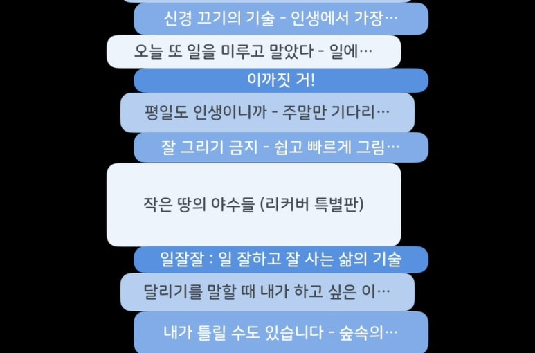

2024년 시작할 때 독서회고는 꼭 하자고 마음먹었으니 작성해본다. (업로드가 2025로 넘어간게 아쉽..) 읽은 책들을 돌아보는건 1년짜리 회고로 가장 어울리는 것 같다. 읽은 책 목록도 1년쯤 쌓이면 적당하고, 거의 1년전에 읽어서 기억이 잘 안나더라도 예전에 읽었던 책의 밑줄들과 써놓은 생각들을 다시 살펴보면서 돌이켜보는 것 자체로도 좋은 시간이었다.
​
​
## 완독 책: 19권
여러 번 읽거나 개발하며 참고해야하는 기술도서는 제외했다. 13권은 좋아서 기록으로 남겼다.
​

### 몰입감 넘치는 잠줄이게 만드는 책:
#### 작은 땅의 야수들 - 김주혜
명절에 각잡고 넷플릭스 대신 본 소설. 일제강점기~광복 이후까지 시간을 자주 건너뛰어서 인물들의 어린아이 시절부터 죽음 또는 노년의 모습까지 그려지는 대하소설. 반짝거리던 인물의 쓸쓸한 퇴장, 끝까지 신념을 잃지 않는 인물 등을 보며 나는 현재 흘러가는 역사 속에서 어떤 사람일까, 어떤 선택을 할까 생각하게 되었다.

#### 가재가 노래하는 곳 - 델리아 오언스
습지에 홀로 살게 된 소녀의 이야기. 습지와 자연, 인간에 대한 깊고 넓은 지식과 통찰이 큰 줄기의 사건과 섬세하게 엮여있다. 후반부부터 결말까지는 숨참고 눈으로 달리게 만드는 몰입감이 있다. 섬세하게 문장 하나하나를 썼을 것 같은 느낌의 예술적 문체.

### 다시 읽으며 메시지를 상기하고 싶은 책
#### 내가 틀릴 수도 있습니다 - 비욘 나티코 린데블라드
제목 자체가 큰 메시지였다. 한동안 자주 상기하며 마음을 다스렸다. '숲속 승려'로 살았던 작가의 솔직한 경험 속 깨달음의 순간들이 생생하게 그려져 있어 흥미롭게 읽었다. 나 스스로를 관찰하지 못하고 분주하게 살아갈 때, 내 통제 밖의 일들에 치여 괴로울 때 다시 읽고 싶다.

#### 신경끄기의 기술 - 마크 맨슨
삶을 잘 추상화하는 기술에 대한 책. 심리상담 가야하나 조금 고민하던 시기에 읽었는데 마인드셋을 바꾸는데 도움이 됐다. (다시 하이라이트를 읽어보니 리셋이 된거 같다. 다시 읽어야지..) 당신은 특별하지 않고 끊임없이 행복할 자격을 부여받지 않는다, 너 자신을 절대 알지 말라. 이런 메시지들을 읽었을 때 원래 흔히 듣던 메시지와 정반대라 당황스러움과 동시에 곧장 납득이 되는 설명이 이어지며, 뼈맞은 것 같은 느낌이 들기도 한다.

#### 열정의 배신 - 칼 뉴포트
이 책도 뼈때림 심한데... '진짜로 내가 좋아하는 일' 을 찾아 퇴사하고 싶을 때 다시 봐야한다. 그러지 말라고 하기 때문. 맞는 일을 찾기보다 제대로 일하는 법을 찾으라고 한다. 모든 직업에 '장인 마인드셋'을 적용할 순 없다고 작가도 이야기하지만 개발자에게는 딱이다.

​
​
## 완독하지 못한 책: 28권
완독을 못한 이유는 다양함. 좋은데 어렵거나 어느 부분부터는 읽고싶지 않은 내용이거나, 다른 책들이 너무 재밌어서 그쪽으로 가다보니 관심이 떨어지거나, 읽다가 생각보다 뻔한 말이라 의도적으로 멈추기도 했다. 특정 부분만 딱 좋아보여서 읽은 적도 있다.
밀리의서재 같은 구독서비스가 좋은게 이런 완독하기 어려운 상황들에서 그만두고 쉽게 다른 책들을 읽기 시작할 수 있다는 것. 1챕터 이상 읽지 않은건 카운팅하지 않았다.
​
### 완독안한 책들 중 기억 남는 책:
#### 찌그러져도 동그라미입니다 - 김창완
건조한 문체로 썼다면 어디서 많이 들어본 말들일 수 있었다. 그러나 사소한 일상이나 조그만 삶의 지혜도 어쩜 이렇게 순수하고 신선하게 표현하는지.
​
#### 우리는 여전히 삶을 사랑하는가 - 에리히 프롬
많은 문장들이 현대 사회와 사람들에 대한 통찰을 담고있다. 이기심, 창의성, 불안, 사랑...에 대해 처음에 문장을 읽었을 땐 '어? 이걸 이렇게 정의한다고?' 라고 생각하지만 곰곰이 생각해보면 너무나 본질적으로 지적한다는 생각이 들었다.
​
​
​
​
## 독서 생활 회고
### 올해 나의 트렌드와 습관
- 종이책보다 전자책을 더 많이 읽게 되었다. 종이책의 질감과 모양이 사랑스러울 때도 있지만, 밥먹으면서 읽는게 불편하고 방에 책 놓을 공간이 포화상태라.. 교보e북이나 밀리의 서재로 읽는다. 책읽고싶지만 좀 귀찮은 시간에 책 쇼핑을 해서 책장에 담아둔다.
- 읽기 시작해보고 좋으면 '북적북적' 앱에 읽고있는 책으로 등록한다.
- 완독하고나면 '북적북적'에 완독 표시를 하고 좋았던 책은 네이버블로그의 서로이웃공개 포스트로 기록한다.
- 병렬독서를 한다.
​
### 좋았던 것
* 책벌레 사람들보단 한참 멀었지만 이전년도보다 2배 이상 많이 읽었다.
* 앱이 내가 읽은 책을 계속 쌓아서 시각화해주니까 완독하고싶은 욕심이 생겨서 더 책을 가까이하고 완독을 해내기도 한 것 같다.
* 문학을 읽으며 재미를 붙였고 책을 찾아 고민을 해소하기도 했다.
* 좋았던 책은 기록하고 소수에게지만 공유했다.
​
### 책을 더 읽지 못하게 한 요소들
* 스마트폰 - 메신저, SNS, 유투브 등 ..
* 완독하려는 욕심은 나고, 책을 더 읽으려니 글자가 잘 안읽힐 때는 그곳에서 꽤 막혀서 몇주가 흘러가버리기도 했다. (그럴땐 꼭 병렬로 읽고 있는 책도 거의 없어서..)
* 평소보다 더 스트레스를 받거나 힘든 날에는 책을 펼치기 쉽지 않았다.
* 좋은 책이지만 그 책을 제대로 읽기 위해 뇌에 힘을 잔뜩 줘야할 때 그 책을 다시 찾는게 쉽지 않다. (특히 평일)
* 병렬로 읽고있는 책 다섯권이 넘어가니까 그중에 재밌는 책 하나를 제외한 책들은 완독 확률이 떨어지는 것 같았다.
​
​
### 2025년에는
* 더 많이 읽기 - 완독책 36권, 완독 안한 책 36권 이상
* 역사, 경제, 과학 등 안읽던 장르도 다 못읽더라도 시도를 여러번 해보자
* 더 쉽게 책 읽기 시작하도록 넛지하기 - 자주 무너지는 시간대에 SNS앱이나 데이터차단. 매일 10분 읽기를 다이어리 체크 등 안될때마다 조금씩 더 생각해보고...
* 책 읽으며 내 생각 메모를 더 많이 하기 - 책을 자주 읽는 공간에 메모지 두기, 아이폰 pinned 메모 활용
* 읽고나서 1-2가지 질문을 함께 기록하자. 기록 템플릿 써봐야겠다