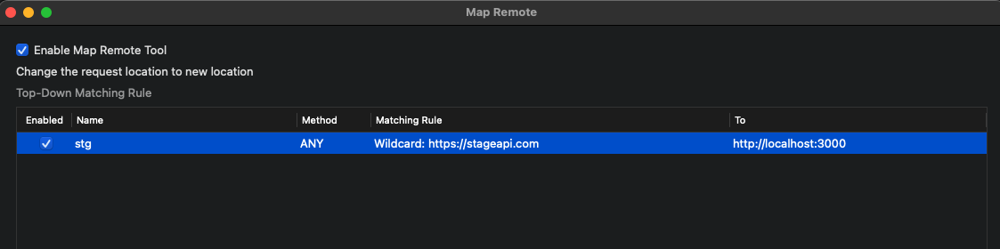
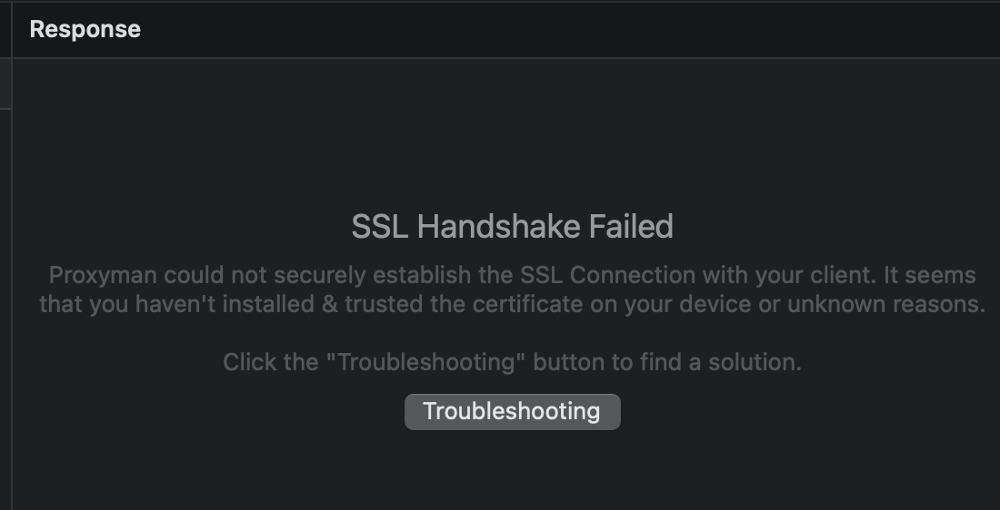
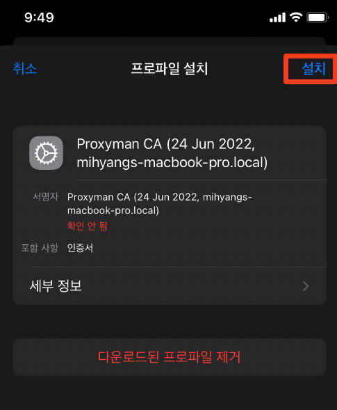

‘Proxyman’이라는 툴에 대해 소개해보려고 한다. 작년에 갓개발자 Kai님이 알려주셔서 레거시 시스템을 파악하고 디버깅하는데에 유용하게 쓰고있다. 어떤 기능을 어떤 상황에서 사용할 수 있는지, 사용방법 등을 알아보자.

## Proxyman 소개

[https://proxyman.io/](https://proxyman.io/) 

> Proxyman is a high-performance macOS app, which enables developers to view HTTP/HTTPS requests from apps and domains, including iOS devices, iOS Simulators, and Android devices.
> 

Proxyman은 앱이나 도메인의 HTTP/HTTPS 요청을 보게 해주는 디버깅 툴이다. 맥북, ios, android 기기에서 HTTP/HTTPS 요청을 intercept해서 확인하고, 변경하고, 재요청 등을 해볼 수 있다.

- 기본적으로 macOS, iOS용으로 나왔지만, 윈도우 용으로도 다운받을 수 있다.
- 비슷한 툴 : Fiddler, Charles proxy 등이 있다.
    - Fiddler는 10day trial 이후에는 유료로만 쓸수있다. (Fiddler everywhere 기준. Fiddler Classic은 mac에서 지원이 안되어서 확인 못해봄)
- 유료인가?? → 다운로드 및 기본적인 기능을 제한적으로 사용하는 것까지는 무료.
    - 기기를 추가하거나 filter, map 등의 기능을 무제한으로 추가하려면 프리미엄 버전($69, 세금포함 $75.9 - 한번 사면 계속 쓸수있음)을 사용해야한다. 아직 무료로 쓰고있는데 연간결제가 아니니 사용빈도가 늘어나면 결제해볼만 한것 같기도..?

## 어떤 기능이 있나 && 기능이 유용한 상황들

1. HTTP/HTTPS request와 response 확인하기
    - web에서의 요청이라면 개발자도구로도 확인할 수 있지만, 이 기능은 iOS기기의 웹뷰/앱에서 어떤 요청을 하는지 파악해야할 때 특히 유용하다.
    - 팀에 합류한지 얼마 안되어서/레거시 코드인 경우 어떤 페이지에서 어떤 API를 호출하는지 모르는데 알아서 서버 엔드포인트를 찾아내어 response나 동작을 픽스해야하는 상황들이 종종 생겼다. 이 툴을 알고부터는 모르면 곧장 proxyman을 열고 셋팅해둔 wifi를 연결해 필요한 페이지에 접속하기만 하면 쉽게 확인할 수 있었다.
2. map local / map remote
    - map remote는 stage환경 디버깅에 가끔 쓴다. (사실 이것까지 하는건 정말 극한의 상황…)
        - mapping rule을 stage서버 엔드포인트→ localhost로 생성하고 enable하기
        - local서버를 디버깅모드로 띄우고 stage 웹/앱 에서 호출해서 디버깅해볼 수 있다.
        
        
3. diff 체크하기 → 개발 환경과 prod 환경의 api 응답이라던지.. 비교해서 확인해야할 때 쓴다. (메인 메뉴에 Diff를 클릭하여 쓸 수 있음)
4. Filter 기능 → 특정 서버에 대한 요청들만 보고싶을 때 유용하다.
5. API response를 변경할 수 있다. - scripting / 이미 있는 요청을 수정해서 보내는 edit and repeat
6. 요청을 직접 생성해서 send하는 compose기능도 있다. → 이건 postman을 쓰다보니 잘 안쓰게되는것 같기도

이외에도 기능이 정말 많다.

### 사용 시 간단한 팁들

- 무수한 요청들이 쏟아져 내가 보고싶은 요청이 쉽게 구분이 어려울 때
    - 기본적으로는 상단 toolbar의 clear아이콘이나 pin기능, highlight 기능을 사용
    - 필터 기능을 사용하면 된다.! 다양한 방법으로 필터를 할 수 있다.
        
       
        
    - ex. CONNECT요청을 제외하고 GET, POST만 보고싶다면
        
       
        

## 그래서 어떻게하면 쓸수있나? - setting 방법

사용하려는 디바이스 별로 [proxyman 문서](https://docs.proxyman.io/debug-devices/ios-device) 또는 proxyman 앱의 메뉴에서 ‘Certificate’ > ‘Install Certificate on 모시깽이’ 를 클릭하면 가이드를 확인할 수 있다. **그대로** 따라하면 금방 할 수 있다. 

(ex. 웹뷰 디버깅용이라면 ‘Install Certificate on iOS’ > ‘Physical Devices..’ 선택)

- 셋팅이 안된다 ㅠ.ㅠ → 아마 설정 중에 뭔가를 빼먹었을 가능성이 크다. 아니면 순서대로 안했거나..
    - ex. ssl handshake failed / wifi로 https요청이 연결 안되는 문제: 폰에 인증서 설치가 제대로 안된 것
        
        
        
    - 굉장히 사소하지만….. 비슷한 이름의 서로 다른 wifi로 폰과 맥북 접속을 하는 바람에 모든 매뉴얼을 따라했는데도 안된 적이 있다. ^^
- 모바일 디바이스와 연결되고나면 왼쪽에 아래 캡처와 같이 Remote devices 목록이 노출되고 내 기기를 확인할 수 있다.
    
    
    
- 인증서 설치가 조금 생소할 수 있어서 캡처를 덧붙여본다.
    - wifi 프록시설정 하고나서 설정에 들어가면 ‘프로파일이 다운로드됨’ 이라는 없던 메뉴가 생기는데 요것을 클릭하여 설치한다.
    
    
    
    
    
    - 설치가 끝이 아니라  설정 > ‘일반’ > ‘정보’ > 맨 아래에 ‘인증서 신뢰설정’으로 들어가서 root인증서 활성화 토글까지 on 해줘야한다.
    
    