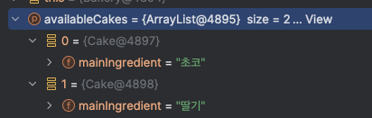

## intro
spring을 늘 쓰지만 자주 접하지 않는 상황에선 설정이 헷갈릴 때가 있다. 얼마 전 한 프로젝트의 bean 설정을 확인하다가 아래 코드와 같이 List타입과 List 내부에 있는 객체 타입 (편의상 `List<T>` 타입과 `T` 타입 이라고 하겠다) 의 설정이 둘 다 있는 경우를 마주했다. 

```java
  @Bean
  List<Cake> availableCakes() {
      return List.of(
          lemonCake(),
          chocolateCake(),
          strawberryCake()
      );
  }

  @Bean
  Cake chocolateCake() {
      return new Cake("초코");
  }

  @Bean
  Cake strawberryCake() {
      return new Cake("딸기");
  }

  @Bean
  Cake lemonCake() {
      return new Cake("레몬");
  }
```

`List<Cake>` 을 주입받아 사용하는 코드:
```java
@Component
class Bakery {

    private final List<Cake> availableCakes;

    Bakery(List<Cake> availableCakes) {
        this.availableCakes = availableCakes;
    }
}
```

~~(케이크가 먹고싶어서 객체이름을 이렇게 바꿔봤다..)~~

원래는 cake가 어떤 순서로 주입되든 상관이 없어서 이 코드는 정상적으로 동작하고 있었다. 그런데 레몬 케이크가 무조건 첫 순서가 되어야하는 요구사항이 추가되었다.

위 코드로 테스트해보니, 생각했던 것과 다르게 Bakery에 주입된 cake 리스트의 첫번째(0번째..)는 초코 케이크였다. 

여러가지 방법이 있어서 순서를 픽스해서 배포는 무사히 했지만 뭔가 여전히 남아있는 궁금한 것들이 있었다. 
.
#

## 궁금한 것
1. `List<T>` 타입과 `T` 타입이 둘 다 bean으로 등록되어있을 때, 정확히 어떻게 동작하는가? 
2. `List<T>`만 정의했을 때와 동작이 어떻게 다른가? (왜 `List<T>`는 무시되는가)
3. 순서를 명시적으로 지정하는 방법은 무엇일까? 

#
### 1. `List<T>` 타입과 `T` 타입이 둘 다 bean으로 등록되어있을 때, 정확히 어떻게 동작하는가?

한가지 잊고있었던 사실은 `List<T>`를 선언하지 않더라도 `T` 타입의 bean들이 있으면 List필드로 주입이 된다는 거였다.

의존성 주입 시 스프링 컨텍스트는 타입이 같은 모든 빈 객체들을 찾아 List에 빈을 주입한다.

```java
  @Bean
  Cake chocolateCake() {
      return new Cake("초코");
  }

  @Bean
  Cake strawberryCake() {
      return new Cake("딸기");
}
```

위 코드처럼 bean 설정하고 나면 아래 Bakery에 주입되는 `List<Cake>`에는 초코, 딸기 케이크가 다 포함된다.

```java
@Component
class Bakery {

    private final List<Cake> availableCakes;

    Bakery(List<Cake> availableCakes) {
        this.availableCakes = availableCakes;
    }
}
```

호옹.. 그렇다면 리스트 타입 bean은 무시하나?? 왜 무시하나??

살펴보다가 까딱 잘못 쓰면 (물론 테스트를 잘 하면 인지할 수 있지만..) 의도랑 달라질 수 있겠단 생각이 들었다.

가령 아래와 같은 코드로 작성한 경우,

```java
  @Bean
  List<Cake> availableCakes() {
      return List.of(
          lemonCake(),
          chocolateCake(),
          strawberryCake()
      );
  }

  @Bean
  Cake chocolateCake() {
      return new Cake("초코");
  }

  @Bean
  Cake strawberryCake() {
      return new Cake("딸기");
  }

/** 실수로 bean 어노테이션을 빼먹었다고 가정 **/
  Cake lemonCake() {
      return new Cake("레몬");
  }
```

⇒ `@Bean`으로 선언한 초코,딸기 케이크만 주입된다. ~~(레몬 어디갔어)~~

  

#

어떻게 동작하는 건지 궁금해서 스프링 프레임워크 코드에 디버그를 찍어서 살펴봤다. 위 코드처럼 `List<Cake>` 타입과 `Cake` 타입의 빈들 모두 bean으로 설정하고 시작.

** spring 버전: 6.1.14

검색을 하다가 `DefaultListableBeanFactory` 라는 클래스를 발견했고, 이곳 저곳 찍어보다가 주입할 객체들을 찾는 `doResolveDependency` 메서드를 발견했다. 이름만 봐도 관련이 있어보인다.
- 이 메서드는 같은 클래스의 `resolveMultipleBeans` 를 호출하고, 그 안에서 `resolveMultipleBeanCollection`가 호출된다.
- `resolveMultipleBeanCollection` 내부를 보면
- beanName (”bakery”) 에 대한 matchingBeans를 findAutowireCandidates()를 호출해서 찾아낸다.

  
  

** resolveMultipleBeanCollection 코드:
```java
@Nullable
private Object resolveMultipleBeanCollection(DependencyDescriptor descriptor, @Nullable String beanName, @Nullable Set<String> autowiredBeanNames, @Nullable TypeConverter typeConverter) {
    Class<?> elementType = descriptor.getResolvableType().asCollection().resolveGeneric(new int[0]);
    if (elementType == null) {
        return null;
    } else {
        Map<String, Object> matchingBeans = this.findAutowireCandidates(beanName, elementType, new MultiElementDescriptor(descriptor));
        if (matchingBeans.isEmpty()) {
            return null;
        } else {
            if (autowiredBeanNames != null) {
                autowiredBeanNames.addAll(matchingBeans.keySet());
            }

            TypeConverter converter = typeConverter != null ? typeConverter : this.getTypeConverter();
            Object result = converter.convertIfNecessary(matchingBeans.values(), descriptor.getDependencyType());
            if (result instanceof List) {
                List<?> list = (List)result;
                if (list.size() > 1) {
                    Comparator<Object> comparator = this.adaptDependencyComparator(matchingBeans);
                    if (comparator != null) {
                        list.sort(comparator);
                    }
                }
            }

            return result;
        }
}
```


- 다시 처음 호출했던 지점으로 돌아가서, `doResolveDependency`는 주입할 빈을 찾았기 때문에 바로 이것을 리턴하고 끝.

```java
Object multipleBeans = this.resolveMultipleBeans(descriptor, beanName, autowiredBeanNames, typeConverter);
if (multipleBeans != null) {
    Object var26 = multipleBeans;
    return var26; // 리턴!
}
```


#

### 2. `List<T>` 타입의 bean만 정의했을 때와 동작이 어떻게 다른가?

List만 bean으로 설정한 뒤 똑같은 부분을 확인해봤다. 

(`doResolveDependency` > `resolveMultipleBeans` > `resolveMultipleBeanCollection` )

`resolveMultipleBeanCollection`  에서는 List안의 element가 어떤 타입인지 확인하고 element의 타입을 찾는다.

```java
private Object resolveMultipleBeanCollection(DependencyDescriptor descriptor, @Nullable String beanName, @Nullable Set<String> autowiredBeanNames, @Nullable TypeConverter typeConverter) {
  Class<?> elementType = descriptor.getResolvableType().asCollection().resolveGeneric(new int[0]);
```

- 이후  `this.findAutowireCandidates` 메서드를 호출할 때 elementType 인자는 `Cake.class` 가 된다.
    - 그렇지만 이번에는 List타입의 bean만 설정해주었기 때문에 이 메서드는 bean을 찾지 못하고 끝난다.

이 다음 동작은

- `doResolveDependency`로 돌아가서,  또다시 findAutowireCandidates를 호출하는데, 이번에는 type에 List를 넘긴다.
`Map<String, Object> matchingBeans = this.findAutowireCandidates(beanName, type, descriptor);`
- 이때는 List타입의 bean은 있으니까 matchingBeans에 `availableCakes` 가 담긴다.
- `doResolveDependency` 전체 코드는 너무 길어서 글 최하단에 붙여놨다.


#
⇒ 여기까지 본걸로 정리해보면

- 스프링 코드 상으로 주입이 필요한 필드가 List타입일 때,
    - 첫번째로 List 안에 있는 element 객체를 먼저 찾는다.
        - if 있으면 → 그대로 리턴. (List타입은 따로 찾지 않음)
        - if 없으면 → List타입의 bean을 찾아 리턴.


#

### 3. 순서를 명시적으로 지정하는 방법은 무엇일까? 

1. List안에 포함되는 각각의 객체가 꼭 bean이어야 하는지 다시 생각해볼 필요가 있다. 아니라면 List 타입만 bean으로 정의하면 리스트에 넣는 순서대로 주입이 된다. 
    
    ```java
        @Bean
        List<Cake> availableCakes() {
            return List.of(
                lemonCake(),
                chocolateCake(),
                strawberryCake()
            );
        }
    
    //    @Bean
        Cake chocolateCake() {
            return new Cake("초코");
        }
    
    //    @Bean
        Cake strawberryCake() {
            return new Cake("딸기");
        }
    
    //    @Bean
        Cake lemonCake() {
            return new Cake("레몬");
        }
    ```
    
    - ⇒ 결과
    ```java
    @Test
    void test1() {
        List<Cake> actual = sut.getAvailableCakes();

        assertThat(actual).hasSize(3);
        assertThat(actual.get(0).getMainIngredient()).isEqualTo("레몬");
        assertThat(actual.get(1).getMainIngredient()).isEqualTo("초코");
        assertThat(actual.get(2).getMainIngredient()).isEqualTo("딸기");
    }
    // => 통과한다.
    ```

2. `@Order` 를 사용하기
- 기본적으로는 scan순서에 따라 bean이 정렬이 되어있는데, `@Order`로 정렬을 하게 되면
- 지정된 `@Order` 의 값에 따라 bean 순서가 정렬이 된다.

```java
    @Bean
    @Order(2)
    Cake chocolateCake() {
        return new Cake("초코");
    }

    @Bean
    @Order(1)
    Cake strawberryCake() {
        return new Cake("딸기");
    }
```

⇒ 결과
```java
@Test
void test1() {
    List<Cake> actual = sut.getAvailableCakes();

    assertThat(actual).hasSize(2);
    assertThat(actual.get(0).getMainIngredient()).isEqualTo("딸기");
    assertThat(actual.get(1).getMainIngredient()).isEqualTo("초코");
}
// => 통과한다.
```


spring문서에 나와있는 방법이고 @Order 만 붙이면 되어서 간편하긴 한데, 아쉬운 것은 각각의 bean 메서드를 확인해야만 전체 순서를 알 수 있다는 것.. 나중의 나 / 다른 팀원에게 어려울 수 있다.

#

3. Composite로 만들기

주입받는 객체 쪽(지금 예제에서는 Bakery) 을 수정할 여지가 있다면, List타입으로 주입받지 않고 Cake를 주입받게 한 다음 Composite Cake를 만들 수도 있다. (Composite객체에서 리스트를 처리)

```java
@Component
class Bakery {
    private final Cake availableCake;

    Bakery(Cake cake) {
        this.availableCake = cake;
    }
}
```

```java
@Bean
@Primary
Cake cakeComposite(
     Cake lemonCake,
     Cake chocolateCake,
     Cake strawberryCake
) {
    List<Cake> cakes = new ArrayList<>();
    cakes.add(lemonCake);
    cakes.add(chocolateCake);
    cakes.add(strawberryCake);
    return new CakeComposite(cakes);
}

@Bean
Cake chocolateCake() {
    return new Cake("초코");
}

@Bean
Cake strawberryCake() {
    return new Cake("딸기");
}

@Bean
Cake lemonCake() {
    return new Cake("레몬");
}
```

#
어떤 방법을 선택할지 고민하기 전에 근본적으로 왜 여기에서 순서를 지정해야하는지, 다른 방법으로 더 심플하게 해결할 수는 없는지도 생각해봐야할 것 같다. ///


#


** 참고:  doResolveDependency() 전체 코드

```java
@Nullable
public Object doResolveDependency(DependencyDescriptor descriptor, @Nullable String beanName, @Nullable Set<String> autowiredBeanNames, @Nullable TypeConverter typeConverter) throws BeansException {
    InjectionPoint previousInjectionPoint = ConstructorResolver.setCurrentInjectionPoint(descriptor);

    Object type;
    try {
        Object shortcut = descriptor.resolveShortcut(this);
        if (shortcut == null) {
            Class<?> type = descriptor.getDependencyType();
            Object value = this.getAutowireCandidateResolver().getSuggestedValue(descriptor);
            if (value == null) {
                Object multipleBeans = this.resolveMultipleBeans(descriptor, beanName, autowiredBeanNames, typeConverter);
                if (multipleBeans != null) {
                    Object var26 = multipleBeans;
                    return var26;
                }

                Map<String, Object> matchingBeans = this.findAutowireCandidates(beanName, type, descriptor);
                if (!matchingBeans.isEmpty()) {
                    Object instanceCandidate;
                    String autowiredBeanName;
                    if (matchingBeans.size() > 1) {
                        autowiredBeanName = this.determineAutowireCandidate(matchingBeans, descriptor);
                        if (autowiredBeanName == null) {
                            if (!this.isRequired(descriptor) && this.indicatesArrayCollectionOrMap(type)) {
                                Object var31 = null;
                                return var31;
                            }

                            Object result = descriptor.resolveNotUnique(descriptor.getResolvableType(), matchingBeans);
                            return result;
                        }

                        instanceCandidate = matchingBeans.get(autowiredBeanName);
                    } else {
                        Map.Entry<String, Object> entry = (Map.Entry)matchingBeans.entrySet().iterator().next();
                        autowiredBeanName = (String)entry.getKey();
                        instanceCandidate = entry.getValue();
                    }

                    if (autowiredBeanNames != null) {
                        autowiredBeanNames.add(autowiredBeanName);
                    }

                    if (instanceCandidate instanceof Class) {
                        instanceCandidate = descriptor.resolveCandidate(autowiredBeanName, type, this);
                    }

                    Object result = instanceCandidate;
                    if (instanceCandidate instanceof NullBean) {
                        if (this.isRequired(descriptor)) {
                            this.raiseNoMatchingBeanFound(type, descriptor.getResolvableType(), descriptor);
                        }

                        result = null;
                    }

                    if (!ClassUtils.isAssignableValue(type, result)) {
                        throw new BeanNotOfRequiredTypeException(autowiredBeanName, type, instanceCandidate.getClass());
                    }

                    Object var14 = result;
                    return var14;
                }

                multipleBeans = this.resolveMultipleBeansFallback(descriptor, beanName, autowiredBeanNames, typeConverter);
                if (multipleBeans != null) {
                    Object var29 = multipleBeans;
                    return var29;
                }

                if (this.isRequired(descriptor)) {
                    this.raiseNoMatchingBeanFound(type, descriptor.getResolvableType(), descriptor);
                }

                Object var28 = null;
                return var28;
            }

            if (value instanceof String) {
                String strValue = (String)value;
                String resolvedValue = this.resolveEmbeddedValue(strValue);
                BeanDefinition bd = beanName != null && this.containsBean(beanName) ? this.getMergedBeanDefinition(beanName) : null;
                value = this.evaluateBeanDefinitionString(resolvedValue, bd);
            }

            TypeConverter converter = typeConverter != null ? typeConverter : this.getTypeConverter();

            try {
                Object var24 = converter.convertIfNecessary(value, type, descriptor.getTypeDescriptor());
                return var24;
            } catch (UnsupportedOperationException var18) {
                Object var27 = descriptor.getField() != null ? converter.convertIfNecessary(value, type, descriptor.getField()) : converter.convertIfNecessary(value, type, descriptor.getMethodParameter());
                return var27;
            }
        }

        type = shortcut;
    } finally {
        ConstructorResolver.setCurrentInjectionPoint(previousInjectionPoint);
    }

    return type;
}
```