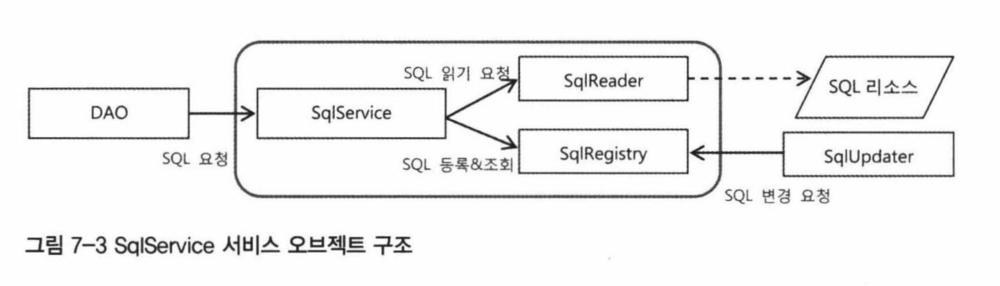
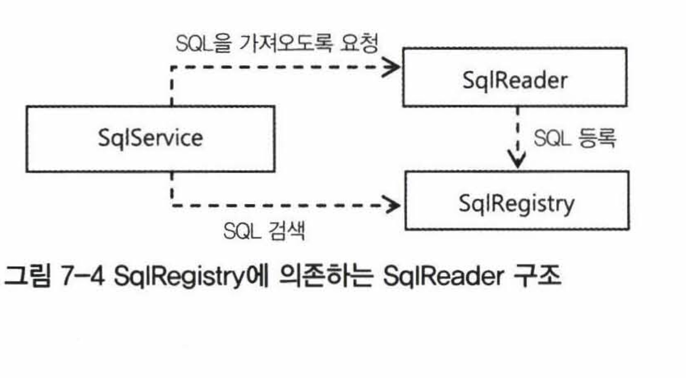
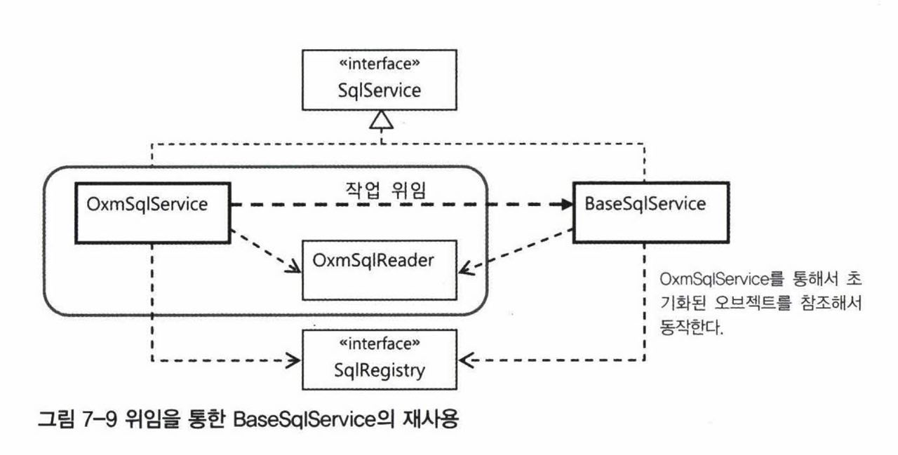
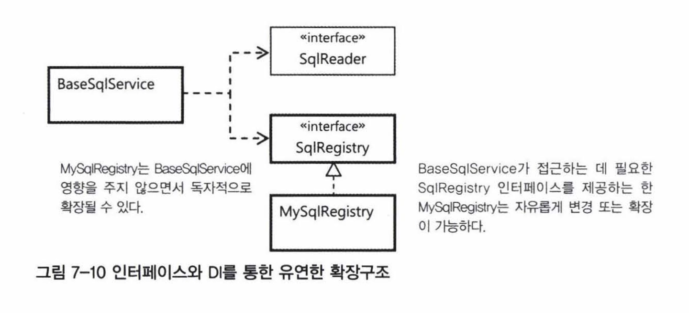

Spring의 3대 핵심기술인 IoC/DI, 서비스 추상화, AOP를 애플리케이션 개발에 활용하여 새로운 기능을 만들어본다. 이를 통해 스프링의 개발철학과 추구하는 가치, 스프링 사용자에게 요구되는 것을 살펴본다.

## 7.1 SQL과 DAO의 분리

- 앞에서 했던 UserDao에서 마지막으로 개선할 점 : SQL을 Dao에서 분리하기

  - 운영 중에 DB의 테이블or필드이름orSQL문이 변경될 수 있는데, 그 때마다 Dao를 수정해서 다시 컴파일하기에는 무리가 있기 때문.

- **어떻게 SQL을 Dao에서 분리할까?**

  1. XML 설정을 이용한 분리: SQL을 xml설정파일의 프로퍼티 값으로 정의해서 DAO에 주입함

     1) 개별 SQL프로퍼티 방식

     ```java
     public class UserDaoJdbc implements UserDao {
     	private String sqlAdd;
     	...
     }
     ```

     ```java
     <bean id="userDao" class="~~">
     	<property name="sqlAdd" value="insert into ~~" />
     ...
     ```

     2) SQL 맵 프로퍼티 방식

     SQL이 점점 많아지면 그때마다 DAO에 DI용 프로퍼티를 주입하기 귀찮으니까, SQL들을 맵에 담아두자.

     ```java
     public class UserDaoJdbc implements UserDao {
     	private Map<String, String> sqlMap;
     	...
     }
     ```

     ```java
     <property name="sqlMap">
     			<map>
     				<entry key="userAdd" value="insert into users(id, name, password, level, login, recommend, email) values(?,?,?,?,?,?,?)" />
     				<entry key="userGet" value="select * from users where id = ?" />
     				...
     			</map>
     </property>
     ```

     ⇒ 문제점: 

     - 데이터 액세스 로직의 일부인 SQL과 애플리케이션 구성정보를 가진 DI설정정보가 섞여있다.
     - 꼭 xml아니고 다른 포맷 파일에 저장해둘 수 있으면 사용/관리 편함
     - sql이 스프링 설정파일로부터 생성되면 runtime에서 변경이 어렵다.

  2. SQL 제공 서비스

     - xml 방식의 문제점을 해결하기 위해, DAO가 사용할 SQL을 제공해주는 기능을 독립시키자.

     - 인터페이스를 어떻게 만들어야 할까?

       ```java
       // SQL에 대한 키 값을 전달하면 그에 해당하는 SQL을 돌려주면 된다.
       public interface SqlService {
       	String getSql(String key) throws SqlRetrievalFailureException;
       }
       ```

       이렇게 정의하고, UserDaoJdbc는 SqlService를 DI받아 인스턴스 변수로 갖고있다가 사용함.

     - 구현

       ```java
       public class SimpleSqlService implements SqlService {
       	private Map<String, String> sqlMap; // sql정보는 이 프로퍼티에 <map>을 이용해 등록.
       	...
       }
       ```

     ⇒ 이렇게 해두면 모든 DAO는 sql을 어디에 저장해두고 가져오는지에 대해 신경쓰지 않아도 되고 그저 SqlService 인터페이스 타입의 빈을  DI 받아서 필요한 SQL을 가져다 쓰기만 하면 된다. SqlService도 DAO에 영향을 주지 않고 다양한 방법으로 구현할 수 있다.

## 7.2 인터페이스의 분리와 자기참조 빈

7.1의 SqlService 인터페이스의 구현을 발전시켜보자.

### XML파일 매핑

- sql을 저장해두는 독립적인 파일을 이용하자.

- JAXB는 xml에 담긴 정보를 파일에서 읽어오는 방법 중 하나. xml 정보를 오브젝트처럼 다룰 수 있어 편리함.

  - 언마샬링(unmarchalling) : XML  to 자바 오브젝트
  - 마샬링 : 자바 오브젝트 to XML
  - sql맵 xml과 sql 맵을 위한 스키마를 jaxb 컴파일러로 컴파일하면, 바인딩용 클래스가 생성된다.

- 언제 JAXB를 사용해 XML문서를 가져올까?

  - DAO가 sql 요청할 때마다 매번 xml파일을 다시 읽는건 비효율적. 한번 읽은건 어딘가에 저장해두고 DAO에서 요청이 올 때 사용해야한다.
  - 처음 SQL을 읽어들이는걸 우선은 생성자에서 하고 동작하게 만들어보자. 변환된 SQL오브젝트는 맵에 저장해놨다가 DAO요청이 오면 전달하는 방식으로.

  ```java
  public class XmlSqlService implements SqlService {
  	private Map<String, String> sqlMap = new HashMap<String, String>(); // 읽어온 SQL을 저장해둘 맵
  	
  	public XmlSqlService() {	// 생성자에서 xml읽어오기
  		String contextPath = Sqlmap.class.getPackage().getName();
  		try {
  			JAXBContext context = JAXBContext.newInstance(contextPath);
  			Unmarshaller unmarshaller = context.createUnmarshaller();
  			InputStream is = UserDao.class.getResourceAsStream("sqlmap.xml");
  			Sqlmap sqlmap = (Sqlmap)unmarshaller.unmarshal(is);
  			for(SqlType sql : sqlmap.getSql()) {
  				sqlMap.put(sql.getKey(), sql.getValue()); // 읽어온 SQL을 맵으로 저장해둔다.
  			}
  		} catch (JAXBException e) {
  			throw new RuntimeException(e);
  		}
  	}
  ```

### 빈의 초기화 작업

- 위 코드에서 개선해야할 점
  - 생성자에서 예외가 발생할 수 있는 복잡한 초기화 작업을 다루는건 좋지 않다.
  - 읽어들일 파일 위치, 이름이 고정돼있음
  - ⇒ 생성자 대신에 loadSql()처럼 초기화 메서드를 사용하고, 파일이름과 위치는 외부에서 DI로 설정하게끔 수정하자.
    - `@PostConstruct` 애노테이션을 통해 초기화 메서드로 지정해줄 수 있다.
      - 생성자와는 달리 프로퍼티까지 모두 준비된 후에 실행되게끔 해주므로, XmlSqlService의 sqlmapFile프로퍼티 값이 주입되고 나서 해당 xml파일을 읽는 로직이 수행될 수 있음.

### 변화를 위한 준비: 인터페이스 분리

- 또 개선할 점
  - SQL을 가져오는 방법이 특정 기술에 고정되어있다. 다른 포맷의 파일에서 읽어와야하는 요구사항이 생기면 XmlSqlService를 직접 수정해야한다.
  - 가져온 SQL정보를 새로운 방식으로 저장하고 검색해서 가져오려면 XmlSqlService를 직접 수정해야한다.

⇒ 분리 가능한 관심사를 나눠서 독립적인 책임을 뽑아보자.

1. SQL 정보를 외부 리소스로부터 읽어오는 책임

2. 읽어온 SQL을 보관해두고 있다가 필요할 때 제공하는 책임

3. 한번 가져온 SQL을 필요에 따라 수정(나중에 다룸)

   

   - SqlReader는 읽어온 다음에 SqlRegistry에 전달해서 등록되게 해야하는데

     - 위 그림처럼 SqlService가 SqlReader에게 데이터를 달라고 요청하고, 그것을 다시 SqlRegistry에 전달하는 방식은 불필요하게 service를 거치게 된다.
     - → SqlReader에게 SqlRegistry 오브젝트를 전달해서 저장하라고 요청하는게 좋다. SqlRegistry가 일종의 콜백 오브젝트처럼 사용된다.

     ```java
     sqlReader.readSql(sqlRegistry);
     ```

     

### 자기참조 빈으로 구현을 시작해보자.

- 책임에 따라 분리되지 않았던 XmlSqlService 클래스 → 세분화된 책임을 정의한 인터페이스(SqlReader, SqlService, SqlRegistry)를 구현하게 하자.
  - XmlSqlService클래스 하나가 세 개의 인터페이스를 다 구현하게 해보기. 단 책임이 다른 코드는 다른 클래스의 코드이지만 직접 접근하지 않고 인터페이스를 통해 간접적으로 사용하게 변경한다.
- 자기참조 빈은 확장이 힘들고 변경에 취약한 구조의 클래스를 유연한 구조로 만들려고 할 때 처음 시도할 수 있는 방법이다.

### 디폴트 의존관계

- 위의 자기참조 빈에서 독립적인 빈으로 나눈다.

- 이렇게 빈을 나눠놓으면 클래스가 늘어나고 의존관계 설정도 다 해줘야하는 부담이 있음

  - → 특정 의존 오브젝트가 기본으로 사용된다면 디폴트 의존관계를 갖는 빈을 만들어보자.
    - 외부에서 DI받지 않는 경우 자동 적용되도록.

  ```java
  public class DefaultSqlService extends BaseSqlService{
  	public DefaultSqlService() { // 생성자에서 자신이 사용할 디폴트 의존 오브젝트를 스스로 DI.
  		setSqlReader(new JaxbXmlSqlReader());
  		setSqlRegistry(new HashMapSqlRegistry());
  	}
  }
  ```

  - 근데 이렇게 하면 sqlMapFile같은 JaxbXmlSqlReader의 프로퍼티를 외부에서 직접 지정할 수 없다. 빈으로 등록되는 것은 DefaultSqlService뿐이므로.
    - 해결: sqlmapFile도 디폴트 값을 주자.

- DI를 사용한다고 해서 항상 모든 프로퍼티 값을 설정에 넣고 모든 의존 오브젝트를 일일이 빈으로 지정할 필요 없다. 자주 사용되는 오브젝트는 디폴트로. 나중에 대신 사용하고싶은 구현체가 있으면 설정에 프로퍼티를 추가하면 된다.

- 이 방법의 단점

  - 설정을 통해 다른 구현체를 사용한다고 해도 생성자에서 일단 디폴트 의존 오브젝트를 다 만들어버림. 사용되지 않는 오브젝트가 만들어지는 것. 이게 복잡하고 무거운 오브젝트일때는 바람직하지 않음
    - 이럴 땐 `@PostConstruct` 초기화 메서드에서 프로퍼티가 없는 경우에만 디폴트 오브젝트를 만드는 방법을 쓰자.

## 7.3 서비스 추상화 적용

- JaxbXmlSqlReader를 발전시켜보자:

  - JAXB외에도 다양한 xml-자바오브젝트 매핑 기술로 바꿔서 사용할 수 있게 하기
  - XML파일을 클래스패스 말고 절대경로, http프로토콜 등 다양한 소스에서 가져올 수 있게 하기

- **OXM추상화 (XML과 자바 오브젝트를 매핑해서 상호 변환해주는 기술)**

  - 서비스 추상화 - JAXB 외에 로우 레벨의 구체적 기술과 API에 종속되지 않고 추상화된 레이어와 API를 제공해서 구현 기술에 대해 독립적인 코드를 작성.
  - SqlReader는 xml을 자바오브젝트로 변환하는 Unmarshaller 인터페이스가 필요하다.

  ```java
  public interface Unmarshaller {
  	...
  	Object unmarshal(Source source) throws IOException, XmlMappingException;
  }
   
  ```

  서비스 추상화를 통해 Jaxb → Castor로 바꿀 때 bean설정만 Castor용 구현 클래스로 변경해주면 손쉽게 수정할 수 있다.

- **추상화된 OXM 기능을 이용하는 SqlService 구현**

  - OxmSqlService - SqlRegistry는 DI받고 SqlReader는 사용성 극대화를 위해 스프링의 OXM 언마샬러를 이용하도록 고정하자.

  ```java
  // SqlReader를 SqlService안에 포함시켜 하나의 빈으로 등록. 
  // SqlReader 구현을 외부에서 사용 못하도록 제한하고 스스로 최적화된 구조로 만들기
  public class OxmSqlService implements SqlService {
  	private final OxmSqlReader oxmSqlReader = new OxmSqlReader();
  
  	private class OxmSqlReader implements SqlReader {
  ...
  	}
  }
  ```

  - 이렇게 하는 이유 - 서비스 추상화를 이용할 때 계속 빈이 늘어나고 반복되는 DI구조가 불편함, 디폴트 의존 오브젝트는 외부에서 프로퍼티를 지정해주기가 어려움.
    - 하나의 빈 설정만으로 SqlService와 SqlReader의 필요한 프로퍼티 설정이 모두 가능하도록 만들기.

- 위임을 이용한 BaseSqlService 재사용

  - `loadSql()` 과 `getSql()` 의 핵심 메서드 구현 코드가 BaseSqlService와 중복됨.
  - → `loadSql()`과 `getSql()` 구현 로직은 BaseSqlService에만 두고 OxmSqlService는 설정과 기본 구성을 변경해주기 위한 어댑터 처럼 BaseSqlService 앞에 두기

  

  ```java
  public class OxmSqlService implements SqlService{
  	private final BaseSqlService baseSqlService = new BaseSqlService();
  
  	@PostConstruct
  	public void loadSql() {
  		// OxmSqlService의 프로퍼티를 통해서 초기화된 SqlReader와 SqlRegistry를 실제 작업을 위임할 대상인 baseSqlService에 주입한다.
  		this.baseSqlService.setSqlReader(this.oxmSqlReader);
  		this.baseSqlService.setSqlRegistry(this.sqlRegistry);
  		
  		// SQL을 등록하는 초기화 작업을 baseSqlService에 위임한다.
  		this.baseSqlService.loadSql();
  	}
  ```

- **Resource 추상화**

같은 클래스패스 외의 루트 클래스패스 또는 웹 상의 리소스 등 다양한 위치에 존재하는 리소스에 대해 단일화된 접근을 하려면 어떻게 해야할까?

- 스프링에는 Resource 라는 추상화 인터페이스가 정의되어있다. 서비스 추상화 오브젝트와 달리 빈으로 등록해서 쓰지는 않고, 값으로 취급한다.

- 접두어(문자열)로 정의된 리소스를 실제 Resource타입으로 변환해주는 ResourceLoader를 제공.

  - Spring 의 ApplicationContext도 ResourceLoader를 상속한다.
    - ApplicationContext가 사용할 스프링 설정정보 xml도 리소스 로더를 통해 Resource형태로 읽어오는 것임. 빈의 프로퍼티 값 변환할때도.
  - Resource타입은 `<property>` 태그의 value를 통해 문자열로 값을 넣음. 이걸 변환해서 오브젝트로 만든다.

  ```java
  <property name="myFile" value="classpath:com/e/mypj/data/myfile.txt" />
  <property name="myFile" value="file:/data/myfile.txt" />
  <property name="myFile" value="https://www.adfjkdlfjlk.com/myfile.txt" />
  ```

- OxmSqlService에 적용하기

  ```java
  private class OxmSqlReader implements SqlReader {
  		private Unmarshaller unmarshaller;
  		private static final String DEFAULT_SQLMAP_FILE = "sqlmap.xml";
  		private Resource sqlmap = new ClassPathResource(DEFAULT_SQLMAP_FILE, UserDao.class);
  		
  		public void setSqlmap(Resource sqlmap) {
  			this.sqlmap = sqlmap;
  		}
  		public void read(SqlRegistry sqlRegistry) {
  			try {
  				Source source = new StreamSource(sqlmap.getInputStream());
  						// 리소스 종류에 상관없이 스트림으로 가져올 수 있다.
  			...
  		}
  }
  ```

  ```java
  <bean id="sqlService" class="springbook.user.sqlservice.OxmSqlService">
  	<property name="sqlMap" value="classpath:springbook/user/dao/sqlmap.xml" />
  // 프로퍼티의 value 부분을 file: 또는 http: 접두어로 바꿔서 다른 데서 가져올 수 있다
  	...
  </bean>
  ```

## 7.4 인터페이스 상속을 통한 안전한 기능확장

권장되진 않지만, 서버 운영중에 SQL을 변경해야할 수도 있다. 애플리케이션을 재시작하지 않고 특정 SQL내용만 변경하고 싶다면 어떻게 해야할까?

### DI와 기능의 확장

- **DI**의 가치는 DI에 적합한 오브젝트 설계를 통해 얻을 수 있다. DI는 런타임 시에 의존 오브젝트를 다이내믹하게 연결해줘서 유연한 **확장**을 하는게 목적.
  - DI를 적용할 때는 최대한 두 개의 오브젝트가 **인터페이스**를 통해 느슨하게 연결되어야 한다.
    - 이유
      1. 다형성을 얻기 위해 - 하나의 인터페이스를 통해 여러 개의 구현을 바꿔가며 사용할 수 있게!
      2. 인터페이스 분리 원칙을 통해 클라이언트와 의존 오브젝트 사이의 관계를 명확하게 해줄 수 있기 때문.
         - ex. A 오브젝트가 B 오브젝트를 사용할 때. B1 인터페이스를 통해서만 B를 사용한다면, A는 B1에게만 관심이 있음. B가 B2 인터페이스도 함께 구현하고 있더라도. 만약 B를 직접 의존한다면 관심 없는 B2 부분의 변경이 A 오브젝트에 영향을 줄 수 있다.
         - 이렇게 목적과 관심이 각기 다른 클라이언트가 있다면 인터페이스를 통해 분리하는 원칙을 `인터페이스 분리 원칙`  이라고 부른다.

### 인터페이스 상속

때로는 인터페이스를 여러 개 만드는 대신 기존 인터페이스를 상속을 통해 확장하는 방법도 사용된다.



- 위 그림에서 MySqlRegistry의 기본 기능에서 이미 등록된 SQL을 변경하는 기능을 넣어서 확장하고 싶다고 할 때, 어떻게 해야할까?

  - 이미 SqlRegistry의 클라이언트가 있기 때문에, SqlRegistry를 수정하는건 좋지 X.
  - 새롭게 추가할 기능을 사용하는 클라이언트를 위해 기존 SqlRegistry를 상속한 인터페이스를 정의하자.

  ```java
  public interface UpdatableSqlRegistry extends SqlRegistry {
  	public void updateSql(String key, String sql) throws SqlUpdateFailureException;
  }
  ```

  - 새로 UpdatableSqlRegistry를 구현한 클래스까지 만든다. 기존 클라이언트인 BaseSqlService, 새로 만든 업데이트 기능을 사용하는 SqlAdminService 둘다 결과적으로 DI받는 구현체는 똑같지만 각각 의존하는 인터페이스는 관심과 필요에 따라 다르게 된다. 이렇게 유연한 확장이 가능함.
  - 잘 적용된 DI는 객체지향적으로 설계된 오브젝트 의존관계에 달려있다.


## 7.5 DI를 이용해 다양한 구현 방법 적용하기

위에서 설계한 UpdateableSqlRegistry를 구현해보자.

- 운영 중인 시스템에서 사용하는 정보를 실시간으로 변경하는 작업  → 동시성 문제를 고려해야함.

1. HashMap 대신 동기화된 해시 데이터 조작에 최적화되게 만들어진 ConcurrentHashMap을 사용해서 구현하기

   - 안전하면서 성능이 보장되는 동기화된 HashMap이다.

   - update기능을 위한 Test 작성

   - Test를 통과하는 UpdateableSqlRegistry 구현

     ```java
     public class ConcurrentHashMapSqlRegistry implements UpdatableSqlRegistry {
     	private Map<String, String> sqlMap = new ConcurrentHashMap<String, String>();
     	
     	@Override
     	public void registerSql(String key, String sql) {
     		sqlMap.put(key, sql);
     	}
     
     	@Override
     	public String findSql(String key) throws SqlNotFoundException {
     		...
     	}
     
     	@Override
     	public void updateSql(String key, String sql) throws SqlUpdateFailureException {
     		if(sqlMap.get(key) == null) {
     			throw new SqlUpdateFailureException(key + "에 해당하는 SQL을 찾을 수 없습니다.");
     		}
     		sqlMap.put(key, sql);
     	}
     
     	@Override
     	public void updateSql(Map<String, String> sqlmap) throws SqlUpdateFailureException {
     		for(Map.Entry<String, String> entry : sqlmap.entrySet()) {
     			updateSql(entry.getKey(), entry.getValue());
     		}
     	}
     
     }
     ```

2. 내장형DB를 사용해서 구현하기

- 저장되는 데이터 양이 많아지고 잦은 조회와 변경이 일어나는 환경이라면, db를 쓰되 별도로 구축하면 비용이 너무 크니 내장형 DB를 사용하자.

  - 내장형 DB는 애플리케이션에 내장되어서 애플리케이션과 함께 시작-종료됨. 메모리에 저장되므로 IO로 인한 부하가 적다.

- 내장형 DB는 애플리케이션 내에서 DB를 기동시키고 초기화 SQL스크립트를 실행시키는 초기화 작업이 별도로 필요하다.

  - 스프링은 초기화 작업을 지원하는 편리한 내장형DB 빌더를 지원한다.

    - 초기 데이터를 위해서는 스크립트를 준비해놓고 애플리케이션 띄울 때 실행되도록 해야 함.
    - 내장형 DB빌더는 DB엔진을 생성 → 초기화 스크립트를 실행해서 테이블과 초기 데이터준비 →  DB에 접근 가능한 Connection을 생성해주는 DataSource 오브젝트(EmbeddedDatabase타입) 를 리턴한다.

    ```java
    new EmbeddedDatabaseBuilder()
    	.setType(내장형DB종류)
    	.addScript(초기화 db script리소스)
    	...
    	.build();
    ```

    - EmbeddedDatabaseBuilder는 초기화 코드가 필요하므로 그냥 빈 x 팩토리빈으로 만드는 것이 좋다. 스프링에는 팩토리빈을 만드는 작업을 대신해주는 전용 태그가 있어 이걸로 빈을 정의해서 사용 가능.

    ```java
    public class EmbeddedDbSqlRegistry implements UpdatableSqlRegistry{
    	SimpleJdbcTemplate jdbc;
    	public void setDataSource(DataSource dataSource) {
    		this.jdbc = new SimpleJdbcTemplate(dataSource); 
    		// 인터페이스 분리원칙을 적용하여 EmbeddedDatabase대신 Datasource 타입을  DI 받게 함 
    	}
    	...
    	@Override
    	public void updateSql(String key, String sql) throws SqlUpdateFailureException {
    		// update()는 SQL 실행 결과로 영향을 받은 레코드의 개수를 리턴한다. \
    		// 이를 이용하면 주어진 키(key)를 가진 SQL이 존재했는지를 간단히 확인할 수 있다.
    		int affected = jdbc.update("update sqlmap set sql_ = ? where key_ = ?", sql, key);
    		if(affected == 0) {
    			throw new SqlUpdateFailureException(key + "에 해당하는 SQL을 찾을 수 없습니다.");
    		}
    	}
    }
    ```

3. 트랜잭션 적용

- 여러개의 SQL을 맵으로 전달받아 한번에 수정할 경우, 중간에 예외가 발생하면??? → 이런 작업은 반드시 트랜잭션 안에서 일어나야 한다.

  - 스프링에서 트랜잭션 적용 시 트랜잭션 경계가 DAO 밖에 있고 범위가 넓으면 AOP를 사용. but SqlRegistry라는 제한된 오브젝트 내에서 간단한 트랜잭션이므로 트랜잭션 추상화 API를 직접 사용해보자.

    - 트랜잭션이 적용되지 않으면 실패하고 적용하면 성공하는 테스트를 만들자.

    ```java
    @Test
    	public void transactionalUpdate() {
    		checkFindResult("SQL1", "SQL2", "SQL3"); // 초기 상태를 확인
    		
    		Map<String, String> sqlmap = new HashMap<String, String>();
    		sqlmap.put("KEY1", "Modified1");
    		sqlmap.put("KEY9999!@#$", "Modified9999"); // 두 번째 SQL의 키를 존재하지 않는 것으로 지정해서 실패하게 만들기
    		try {
    			sqlRegistry.updateSql(sqlmap);
    			fail();
    		}catch (SqlUpdateFailureException e) {	
    		}
    		// 첫번째 SQL은 정상적으로 수정했지만 트랜잭션이 롤백되기 때문에 다시 변경 이전 상태로 돌아와야한다. 
    		// 트랜잭션이 적용되지 않는다면 변경된 채로 남아서 테스트는 실패할 것이다.
    		checkFindResult("SQL1", "SQL2", "SQL3");
    	}
    ```

    - 트랜잭션 적용 코드에 템플릿/콜백 패턴을 적용한 TransactionTemplate을 쓰자.
      - 트랜잭션 템플릿이 만드는 트랜잭션 경계 안에서 동작할 코드를 콜백 형태로 만들고 execute()에 전달

    ```java
    @Override
    	public void updateSql(final Map<String, String> sqlmap) throws SqlUpdateFailureException {
    		transactionTemplate.execute(new TransactionCallbackWithoutResult() {
    			@Override
    			protected void doInTransactionWithoutResult(TransactionStatus status) {
    				for(Map.Entry<String, String> entry : sqlmap.entrySet()) {
    					updateSql(entry.getKey(), entry.getValue());
    				}
    			}
    		});
    	}
    ```

## 7.6 스프링 3.1의 DI

### 자바 언어의 변화와 스프링

1. 애노테이션의 메타정보 활용
   - 자바 코드의 메타정보를 이용한 프로그래밍 방식의 대표적인게 애노테이션.
   - 애노테이션은 자바코드가 실행되는 데 직접 참여하지 못한다. 오브젝트에 타입을 부여X, 상속이나 오버라이딩도 안됨
   - 왜 애노테이션 활용이 늘어났나
     - 핵심로직을 담은 자바코드 + Ioc방식의 프레임워크 + 프레임워크가 참조하는 메타정보 이 세가지로 구성하는 방식에 잘 어울림.
     - 애플리케이션을 구성하는 많은 오브젝트와의 관계를 설정할 때 단순 자바코드로 만들어두면 불편함. → 그래서 xml로 전환했음. → 애노테이션 등장. 애노테이션은 자바코드의 일부로 사용되기 때문에 xml보다 유리한 점이 많다.
       1. 정의하기에 따라서 타입, 필드, 메서드, 파라미터 등 여러 레벨에 적용 가능.
       2. 단순히 애노테이션 하나 추가하는 것만으로 애노테이션이 부여된 클래스의 패키지, 클래스 이름, 접근제한자 ...(클래스 기준)등 메타정보를 알 수 있다.
          - xml은 이걸 다 명시적으로 표현해야하고, 텍스트 정보라서 오타가 발생하기도 쉬움. 리팩토링할때 안전하지 못함.
     - 단점은  변경할때마다 매번 클래스를 새로 컴파일해줘야한다는것
     - but 흐름은 애노테이션으로 가고있다. 스프링 3.1부터 xml을 완전히 배제한 설정이 가능
2. 정책과 관례를 이용한 프로그래밍
   - 메타정보를 활용하는 프로그래밍 방식 → 명시적으로 동작 내용을 기술하는 대신 코드 없이도 미리 약속한 규칙/관례를 따라서 프로그램이 동작하도록 만드는 프로그래밍 스타일을 적극 포용함
     - 규칙, 관례의 예시: `<bean>`태그 → 빈 오브젝트생성, new 키워드→ 인스턴스 생성 등
     - 단점:  프로그래밍언어, API 외에 이런 정책을 기억 못하거나 잘못 안다면 의도대로 동작하지 않는 코드를 만들 수 있다..
     - 간결하고 빠른 개발이 가능하기 때문에 이런 스타일이 늘어남.

7.6절에서는 지금까지의 예제 코드를 스프링 3.1의 DI스타일로 바꾸는 과정을 설명한다.

### 7.6.1. 자바 코드를 이용한 빈 설정

XML을 없애자

1. 테스트 컨텍스트 변경

```java
@ContextConfiguration(classes=TestApplicationContext.class) // 원래 xml로 설정하던걸 변경함
public class UserDaoTest {
```

- xml과 자바 코드 설정정보를 동시에 사용할 수 있다. 원래의 xml은 `@ImportResource` 로 가져오고 같이 합쳐서 쓰다가 단계적으로 옮기자.

2. `<context:annotation-config />` 제거

- xml을 쓸 때는 이 태그에 의해 등록되는 빈 후처리기가 `@PostConstruct` 와 같은 표준 애노테이션을 인식해서 자동으로 메서드를 실행해줬음.
- `@Configuration`이 붙은 설정 클래스를 사용하는 컨테이너가 사용되면, 컨테이너가 직접 `@PostConstruct` 를 처리하는 빈 후처리기를 등록해준다.

3. `<bean>`의 전환

- `@Bean` 이 붙은 public 메서드. 메서드 이름= `<bean>`의 id.

- 리턴값은 구현클래스보다 인터페이스로 해야 DI에 따라 구현체를 자유롭게 변경할 수 있다.

- 근데 메서드 내부에서는 빈의 구현 클래스에 맞는 프로퍼티 값 주입이 필요함.

  ```java
  @Bean
      public DataSource dataSource() {
          SimpleDriverDataSource dataSource = new SimpleDriverDataSource ();
  					...
          return dataSource;
      }
  ```

4. 전용 태그 전환

Spring 3.1은 xml에서 자주 사용되는 전용 태그를 `@Enable`로 시작하는 애노테이션으로 대체할 수 있도록 애노테이션을 제공함. 

ex. `<tx:annotation-driven />`   →  `@EnableTransactionManagement` 

### 7.6.2. 빈 스캐닝과 자동 와이어링

- **자동 와이어링**

  - 자동와이어링을 이용하면 컨테이너가 이름/타입 기준으로 주입될 빈을 찾아준다 → 프로퍼티 설정을 직접 해주는 코드를 줄일 수 있다.

  - setter에 `@Autowired` 붙이면 → 파라미터 타입을 보고 주입 가능한 타입의 빈을 모두 찾음. 주입 가능한 빈이 1개일땐 스프링이 setter를 호출해서 넣고, 2개 이상일때는 그 중에서 프로퍼티와 동일한 이름의 빈을 찾아 넣고 없으면 에러.

    ```java
    @Autowired
    public void setDataSource(DataSource dataSource) {
    	this.jdbcTemplate = new JdbcTemplate(dataSource);
    }
    ```

  - setter에서 필드 그대로 넣는다면 필드에 직접 `@Autowired` 를 적용할 수 있다.

    - 위 예시코드의 경우에는 필드에 직접 하면 안됨(setter에 JdbcTemplate을 생성하는 코드가 있으므로 필드로 대체가 X)

  - autowiring 장점: DI 관련 코드를 대폭 줄일 수 있음

  - autowiring 한계: 다른 빈과 의존관계가 어떻게 맺어져있는지 파악하기 어렵다 ㅠ

- `@Component`

  - 클래스에 붙이면 빈 스캐너를 통해 자동으로 빈으로 등록될 대상이 된다.

  - `@Component` annotation이 달린 클래스를 자동으로 찾아 빈으로 등록해주게 하려면 빈 스캔 기능을 사용하겠다는 annotation 정의가 필요함: `@ComponentScan(basePackages="springbook.user")`

    - 참고: Spring boot에서는 `@SpringBootApplication` 에 `@Component` 가 포함되어있음 😉

  - `@Component`로 추가되는 빈의 id는 별도 지정 없으면 클래스 이름의 첫 글자를 소문자로 바꿔서 사용.

    - 별도 지정은 `@Component("userDao")` 와 같이 함

  - @Component를 메타 애노테이션으로 갖고 있는 애노테이션들

    - 메타 애노테이션?

      - 애노테이션끼리는 상속x, 인터페이스 구현 x 기 때문에,  여러개의 애노테이션에 공통 속성을 부여하려면 메타 애노테이션을 이용. 애노테이션의 정의에 부여된 애노테이션을 말한다.

      ```java
      @Component
      public @interface Service { // annotation은 @interface 키워드로 정의한다.
      ...
      }
      ```

    - bean 스캔 검색 대상 + 부가적인 용도의 마커로 사용하기 위한

      - @Repository(Dao기능 제공 클래스), @Service(비즈니스 로직을 담은 빈) 와 같은 빈 자동등록용 애노테이션이 사용된다.

- 여기까지 코딩하고 돌리면 😢
- 
  [https://stackoverflow.com/questions/22526695/java-1-8-asm-classreader-failed-to-parse-class-file-probably-due-to-a-new-java](https://stackoverflow.com/questions/22526695/java-1-8-asm-classreader-failed-to-parse-class-file-probably-due-to-a-new-java) 

  ⇒ spring 3.2.9로 업데이트 필요

### 7.6.3. 컨텍스트 분리와 @Import

- **컨텍스트 분리**

  성격이 다른 DI정보를 분리해보자.  - ex. 테스트를 위해 만든 빈은 테스트에만 사용돼야하고 실제 애플리케이션에는 포함하지 않도록

  - `@Configuration` 이 붙은 빈 설정 파일을 테스트에만 쓰이는 설정(AppContext)과 실서비스 동작 시 쓰이는 설정(TestAppContext) 두가지로 분리

  - 실서비스에는 AppContext만 참조, 테스트에서는 AppContext, TestAppContext 두가지 모두 사용

    ```java
    @ContextConfiguration(classes={TestAppContext.class, AppContext.class})
    public class UserDaoTest {
    ```

- `@Import`

  - SQL서비스처럼 다른 애플리케이션에서도 사용할 수 있고, 독립적으로 개발/변경될 가능성이 높은 서비스는 독립적인 모듈처럼 취급하는게 좋다.

    - 이것도 DI설정정보 클래스를 분리하자. 대신에 애플리케이션이 동작할 때 항상 필요하니 AppContext에 함께 적용되도록 하기

    ```java
    @Import(SqlServiceContext.class)
    public class AppContext {
    ```

### 7.6.4. 프로파일

- 테스트와 운영환경에서 각기 다른 빈 정의가 필요한 경우 - 양쪽 모두 필요하면서 내용만 다른 것들은 설정정보를 변경하고 조합하는 것으로는 한계가 있음 (ex. mailSender)

- ⇒ 실행환경에 따라 빈 구성이 달라지는 내용을 프로파일로 정의해서 만들어두고, 실행시점에 지정해서 사용

- 설정 클래스 단위로 지정하고 context를 쓰는곳에서 active profile을 지정

  ```java
  @Configuration
  @Profile("test")
  public class TextAppContext {
  ```

  ```java
  @ActiveProfiles("test")
  @ContextConfiguration(classes=AppContext.class)
  public class UserServiceTest {
  ```

- 정말 active profile이 제대로 적용되어서 지정한 프로파일의 빈설정만 적용되고 나머지는 무시된건지 확인하고싶다면?

  - 스프링 컨테이너에 등록된 빈 정보 조회방법
    - 스프링 컨테이너는 모두 BeanFactory 인터페이스를 구현함. 이중DefaultListableBeanFactory 클래스로 빈을 등록하고 관리한다. 이걸 `@Autowired`로 주입받아서 이용하면 된다.

- 쪼개고보니 파일이 많아 전체 구성을 살펴보기가 어렵다 → static nested class를 써서 하나의 파일로 합치기

### 7.6.5. 프로퍼티 소스

- db 연결정보와 같은 부분은 환경에 따라 다르게 설정 && 필요에 따라 쉽게 변경할 수 있어야함 → 프로퍼티 파일에 저장해놓고 쓰자.

- 컨테이너가 프로퍼티 값을 가져오는 대상을 property source라고 한다.

  ```java
  @PropertySource("/database.properties")
  public class AppContext {
  ```

  - 이렇게 등록해두면 컨테이너가 관리하는 Environment 타입의 환경 오브젝트에 프로퍼티가 저장된다.

    ```java
    @Autowired Environment env;
    
    @Bean
    public DataSource dataSource {
    	...
    	try {
    		// Class타입이어야해서 타입 변환이 필요.
    		ds.setDriverClass(Class<? extends java.sql.Driver>Class.forName(env.getProperty("db.driverClass"));
    	} catch (ClassNotFoundException e) {
    		...
    	}
    	ds.setUrl(env.getProperty("db.url"));
    }
    ```

  - 프로퍼티 값을 직접 DI받을 수도 있다. `@Value` 로 필드 주입.

    - 이 방식을 쓰려면 PropertySourcesPlaceholderConfigurer 빈 정의가 필요하다.

    ```java
    @Bean
    public static PropertySourcesPlaceholderConfigurer placeholderConfigurer() {
    	return new PropertySourcesPlaceholderConfigurer();
    }
    ```

    - driverClass처럼 타입 변환이 필요한 프로퍼티를 스프링이 알아서 처리해주는 장점이 있다.

   

  - 에러

    - application.yml로 하면 에러 😭 아마도 버전 때문일 것으로 예상..

  - 참고: [spring boot에서의 외부 프로퍼티 configuration](https://docs.spring.io/spring-boot/docs/1.2.3.RELEASE/reference/html/boot-features-external-config.html)

### 7.6.6. 빈 설정의 재사용과 @Enable*

- SqlServiceContext를 sql서비스 라이브러리 모듈에 포함시켜서 재사용 가능하게 하기.

  - 특정 sqlmap 파일위치에 종속적인 상태. 어떻게 분리할 수 있을까?

  ```java
  private class OxmSqlReader implements SqlReader {
  	private Unmarshaller unmarshaller;
  	private Resource sqlmap = new ClassPathResource("sqlmap.xml", UserDao.class);
  ```

  - SQL매핑 리소스는 빈 클래스 외부에서 설정할 수 있어야 한다.

  ```java
  		@Bean
      public SqlService sqlService() throws IOException {
          ...
  				sqlService.setSqlmap(new ClassPathResource("sqlmap.xml", UserDao.class);
          return sqlService;
      }
  ```

  - 여전히 UserDao에 종속된 정보가 남아있어서 다른 애플리케이션에서 SqlServiceContext를 재사용할수가 없다. DI설정용 클래스인 SqlServiceContext까지 독립적인 모듈로 분리하려면 - 이것도 DI 방식을 사용한다:

    - SqlMapConfig 인터페이스를 정의
    - SqlMapConfig의 구현체에서 리소스를 어디서 가져오는지를 구현

    ```java
    public class UserSqlMapConfig implements SqlMapConfig{
        @Override
        public Resource getSqlMapResource() {
            return new ClassPathResource("/sqlmap.xml", UserDao.class);
        }
    }
    ```

    ```java
    public class SqlServiceContext {
        @Autowired SqlMapConfig sqlMapConfig; // interface에 의존하게 한다.
    ...
    }
    ```

    - ⇒ 이렇게 하면 SqlServiceContext코드가 SQL매핑파일의 위치변경에 영향을 받지 않음.

  - 음 그런데 리소스 위치도 빈 설정과 관련된 정보인데, 이것 때문에 새로운 클래스를 하나 추가하기보다 빈 설정을 더 간단하게 할수는 없을까?

    - AppContext도 빈이라서 `@Autowired` 를 이용할 수 있다. AppContext가 SqlMapConfig 인터페이스를 직접 구현하게 해보자.

  - // 여기까지 해놓으면,  SQL서비스가 필요한 애플리케이션은 메인 설정클래스에서 `@Import` 로 SqlServiceContext 빈설정을 추가하고 SqlMapConfig를 구현해서 SQL매핑 파일 위치를 지정하면 됨.

- `@Enable*` annotation

  - 모듈화된 빈 설정을 가져올 때, `@Enable`로 시작하는 메타 어노테이션을 사용하자.

    - `@Repository`, `@Service` 처럼. 빈의 종류나 계층을 나타내고 특정 애노테이션이 달린 빈만 AOP로 부가기능을 넣을 수도 있다.

    ```java
    @Import(value = SqlServiceContext.class)
    public @interface EnableSqlService {
    }
    ```