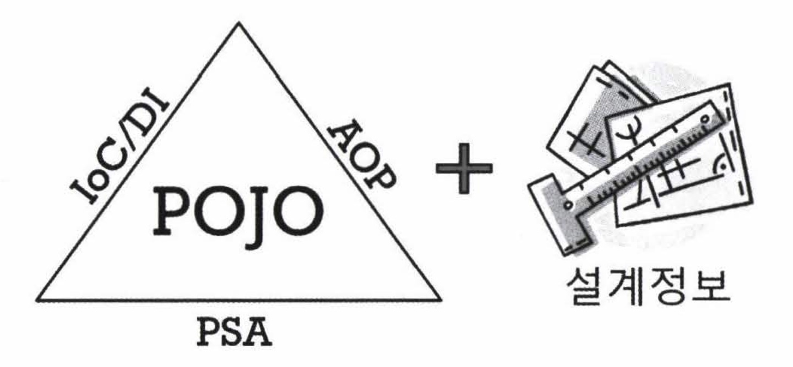

## 8.1 스프링의 정의

자바 엔터프라이즈 개발을 편하게 해주는 오픈소스 경량급 애플리케이션 프레임워크

- **애플리케이션 프레임워크**

  - 일반적인 라이브러리, 프레임워크는 특정 업무 분야나 한가지 기술에 특화된 목표를 가지고 만들어진다. (ex. 로깅, ORM라이브러리 등등)

  - ↔ 애플리케이션 프레임워크는 특정 계층이나, 기술, 업무 분야에 국한되지 않고 애플리케이션의 전 영역을 포괄하는 범용적인 프레임워크.

    - 스프링의 기원:  Rod Johnson의 J2EE기술서적에서 J2EE(Java2 Enterprise Edition) 애플리케이션 설계 개발 전략에 대한 예제코드. '항상 프레임워크 기반으로 접근하라' - 프레임워크를 만들고 그것을 이용하는 코드 → 예제수준으로 두기에 아깝다 → 오픈소스 프로젝트 시작

      

      - 스프링의 기원이 된 이 책 자체가 자바 엔터프라이즈 개발의 전 계층에 등장하는 기술과 전 영역에 대한 효과적인 설계와 개발 기법을 다루었기 때문에, 스프링은 자바 엔터프라이즈 개발 전략의 핵심을 담아서 개발됨 🙂

    - 애플리케이션 프레임워크는 단지 여러계층의 다양한 기술을 한데 모아둔 것이 아님. 스프링이 MVC프레임워크다, IoC/DI프레임워크다 라고 한다면 일부 영역이나 기술에만 주목하는 것..

    - 스프링의 일차적인 목적은 핵심 기술에 담긴 프로그래밍 모델을 일관되게 적용해서 엔터프라이즈 애플리케이션 전 계층과 전 영역에 전략과 기능을 제공해줌으로써 애플리케이션을 편리하게 개발하게 해주는 애플리케이션 프레임워크로 사용되는 것

- **경량급(lightweight)**

  - 스프링이 가볍다니?? → 불필요하게 무겁지 않다는 의미. 위 책에서 비판하는 EJB같은 과도한 엔지니어링이 적용된 기술의 복잡함에 반대되는 개념.
    - EJB는 개발 환경, 서버, 개발과 빌드 등등 모두 무겁고 복잡했음. 고가의 WAS가 필요 등등
    - ↔ 스프링은 가장 단순한 서버환경인 Tomcat, Jetty에서도 동작. 단순한 개발툴과 기본적인 개발환경으로도 엔터프라이즈 개발에서 필요로 하는 주요한 기능을 갖춘 애플리케이션을 개발하기에 충분하다.
    - 코드도 EJB보다 상대적으로 작고 단순하다 : 프레임워크와 서버환경에 의존적인 부분을 제거해주기때문.

- **자바 엔터프라이즈 개발을 편하게**

  - 스프링은 근본적인 부분에서 엔터프라이즈 개발의 복잡함을 제거해내고 진정으로 개발을 편하게 해주는 해결책을 제시함.
    - EJB의 목표도 이거였지만, EJB는 이 목표를 향한 과정에서 다른 차원의 더 큰 복잡함을 가져옴...
    - 편리한 애플리케이션 개발이란,  개발자가 복잡하고 실수하기 쉬운 로우레벨 기술에 많은 신경을 쓰지 않으면서도 애플리케이션의 핵심인 비즈니스 로직을 빠르고 효과적으로 구현하는 것.!
    - 스프링프레임워크는 개발자들이 프레임워크 기술보다 애플리케이션의 로직에 더 많은 관심과 시간을 쏟게 해줌.

- **오픈소스**

  - Apache License 2.0
    - 상업 목적의 제품에 포함해도 되고, 수정해서 써도 수정한 소스를 공개할 의무가 없음
  - 오픈소스의 장점: 투명한 방식으로 다양한 참여. 매우 빠르고 유연한 개발이 가능.
  - 단점: 지속적이고 안정적인 개발이 계속될지가 불확실함. 개발자 개개인에게 의존적임.
  - 스프링같은 프레임워크는 엔터프라이즈 시스템 개발에 사용되는데, 버그가 방치되거나 안정적인 개발이 진행되지 않는건 크리티컬..
  - → 오픈소스 개발이라는 방법을 선택해서 스프링의 개발과정은 공개되어있지만 공식적 개발은 SpringSource라는 기업이 전담함.

## 8.2 스프링의 목적

- 목적을 이해하고, 그 목적을 이루는 도구로 잘 활용해야 제대로 된 가치를 얻을 수 있다.
  - (자바의 근본적인 목적은 객체지향 프로그래밍을 통해 유연하고 확장성 좋은 애플리케이션을 빠르게 만드는 것. 이걸로 절차지향적으로 사용한다면 이런 가치를 얻을 수 없음)
- 스프링의 목적은 엔터프라이즈 애플리케이션 개발의 복잡성에 대응하여 편하게 하려는 것. 원래 엔터프라이즈 개발은 편하지 않다. 스프링이 이걸 어떻게 해결했는지 전략을 살펴보자.

### **엔터프라이즈 개발의 복잡함**

1. 기술적인 제약조건과 요구사항이 늘어가기 때문
   - 많은 사용자의 요청 동시에 처리하고 기업의 핵심정보나 중요한 시스템을 다룬다 → 서버 성능, 보안과 안정성, 확장성을 신경써야함. 비즈니스 로직 이외의 기술적 고려사항이 많음.
2. 비즈니스 로직의 복잡함이 증가하기 때문
   - 업무적인 변화의 속도가 빠르고 복잡해짐 → 기능 요구사항과 정책이 자주 바뀌고 자주 수정해줘야함.
3. 1, 2의 복잡함이 한데 얽혀있기 때문

### **복잡함을 해결하려는 도전**

- 실패한 해결책: EJB
  - 애플리케이션 핵심 로직에서 일부 기술적 코드를 분리하다가 오히려 EJB라는 환경과 스펙에 종속적인 코드로 만들게 강제함. 자바언어가 원래 갖고있던 장점을 잃어버리게 함.
- 효과적인 해결책: Spring
  - 비침투적인 방식을 사용함.
    - EJB처럼 어떤 기술을 적용했을 때 그 기술과 관련된 코드나 규약이 코드에 등장하는 경우 : 침투적인(invasive) 기술 ⇒ 꼭 필요한 기능이 아니면서 마구 등장한다면 복잡함을 가중시킴
    - **비침투적 기술**: 기술의 적용 사실이 코드에 직접 반영되지 않음. 기술의 적용에 따라 필요한 작업만 하고, 코드의 설계와 구현 방식을 제한하지 않음.
    - ⇒ 기술적 복잡함과 비즈니스 로직을 다루는 코드를 깔끔하게 분리할 수 있었다.

### **복잡함을 상대하는 스프링의 전략**

1. **기술적인 복잡함을 상대하는 전략**
   - 문제1 : 기술에 대한 접근방식이 일관성이 없고 특정 환경에 종속적 (과거에는 서버가 바뀌고 적용 조건이 바뀌면 적용하는 기술이 달라지고 코드가 바뀔 수 있었음)
     - ⇒ 서비스 추상화
       - ex. 트랜잭션 추상화, OXM추상화, 데이터 액세스에 대한 일관된 예외변환 기능 등
       - 로우레벨 기술구현 부분과 기술을 사용하는 인터페이스를 분리하고, 환경과 세부 기술에 독립적인 접근 인터페이스를 제공한다.
   - 문제2: 기술적인 처리를 담당하는 코드가 성격이 다른 코드에 섞여서 등장
     - ⇒ AOP
       - ex. 트랜잭션, 보안적용, 로깅, audit 등
       - 기술관련 코드를 깔끔하게 분리해서 별도의 모듈로 관리
2. **비즈니스와 애플리케이션 로직의 복잡함을 상대하는 전략**
   - 자주 수정되고, 오류가 있으면 치명적.
   - 과거: 비즈니스 로직의 상당 부분을 DB에 두는게 유행. SQL을 통해 비즈니스 로직을 표현하고, DB에서 동작하는 저장 프로시저를 통해 핵심 로직을 처리.
     - But 가장 확장하기 힘들고 확장에 많은 비용이 드는 공유자원인 DB에 엄청난 부담이 가게됨 + 개발, 유지보수, 테스트 다 어렵다.
   - 요즘: 비즈니스로직은 애플리케이션 안에서 처리. 확장하기 쉽고, 테스트하기도 쉬움. 객체지향 언어의 장점을 살려서 설계된 자바를 잘 활용하면 비즈니스 로직을 효과적으로 구현할 수 있다. 스프링은 비침투적인 기술이므로 이런 객체지향 프로그래밍을 방해했던 요소를 제거하도록 도와줄 뿐 관여하는건 없음.
3. **기술과 비즈니스 로직의 복잡함을 해결하는데 공통으로 사용하는 도구: 객체지향과 DI**
   - 스프링의 모토는 '기본으로 돌아가자' 이다. 객체지향의 설계 기법을 잘 적용할 수 있는 구조를 만들기 위해 DI같은 유용한 기술을 편하게 적용하도록 도와주는 것이 기본 전략.
   - 서비스 추상화, 템플릿/콜백, AOP 등의 기법들 모두 DI를 바탕으로 하고 있음.
   - DI는 특별한 기술이라기보단 유연하게 확장할 수 있는 객체지향 설계를 하다보면 적용되는 프로그래밍 기법이다. 그리고 더 객체지향적 설계와 개발로 이끌어준다.
     - DI를 의식하다보면 오브젝트를 설계할 때 자주 DI를 적용할 후보가 없을까를 생각해보게 됨. (바뀔 수 있는건 무엇일까? 성격이 다르고 변경의 이유가 다른 기능은 무엇일까?)
     - DI는 좋은 오브젝트 설계의 결과물. 반대로 DI를 열심히 적용하다보면 객체지향적 장점을 잘 살린 설계가 나온다.
   - 스프링이 비침투적인 기술을 만드는 노력을 한 이유는 순수 비즈니스 로직을 담고 있는 코드에는 객체지향 설계에서 나온 도메인 모델을 쉽게 적용할 수 있기 때문.
   - 결국 스프링의 기술과 전략은 객체지향이라는 자바 언어가 가진 강력한 도구를 극대화해서 사용할 수 있도록 돕는 것. 객체지향을 잘 활용하는건 개발자의 몫.

## 8.3 POJO 프로그래밍

좀더 기술적으로 스프링이 지향하는 목적을 알아보자.

"분리됐지만 반드시 필요한 엔터프라이즈 서비스 기술을 POJO 방식으로 개발된 애플리케이션 핵심 로직을 담은 코드에 제공한다" 

- Spring application = POJO를 이용해서 만든 애플리케이션 코드 + POJO가 어떻게 관계를 맺고 동작하는지를 정의해놓은 설계 정보.
- IOC/DI, AOP, PSA(Portable Service Abstraction) 은 애플리케이션을 POJO로 개발할수있게 해주는 가능기술(enabling technology)

### POJO란 ??

Plain Old Java Object. 

마틴 파울러가 만들어낸 용어. 왜 자바의 단순한 오브젝트를 안쓰는가? 평범한 자바오브젝트에는 EJB와 같은 그럴싸한 이름이 없기 때문이었다...  그래서 있어보이도록 만든 이름이 POJO 🤣

### POJO의 조건

1. 특정 규약에 종속되지 않는다.
   - 자바 언어와 꼭 필요한 API외에는 종속되지 않아야 한다. ↔ EJB나 스트럿츠의 특정 클래스를 상속해서 써야하는 오브젝트
2. 특정 환경에 종속되지 않는다.
   - ↔ 특정 OS에서 제공하는 기능을 직접 호출, WebLogic 서버에서만 사용가능한 API를 직접 쓴 코드
   - !! 비즈니스 로직을 담고있는 POJO클래스는 웹이라는 환경 정보나 웹 기술을 담고 있는 클래스/인터페이스를 사용해서는 안된다.
     - 나중에 웹 컨트롤러와 연결돼서 사용할게 뻔하다고 해도 직접적으로 웹이라는 환경으로 제한해버리는 오브젝트나 API에 의존하면 웹 외의 클라이언트가 못쓰고, 독립적으로 테스트하기도 어려워짐.
     - 비즈니스 로직을 담은 코드에 HttpServletRequest, HttpSession, 캐시 등등을 직접 이용하는 부분이 있다면 진정한 POJO가 아님.
3. 객체지향적 자바언어의 기본에 충실하다.
   - ↔ 책임과 역할이 다른 코드를 한 클래스에 몰아넣기, 다른 레이어 코드와 강한 결합...

⇒ 진정한 POJO란 객체지향적 원리에 충실하면서, 환경과 기술에 종속되지 않고 필요에 따라 재활용될 수 있는 방식으로 설계된 오브젝트. 이런 POJO에 애플리케이션의 핵심로직과 기능을 담아 설계하고 개발하는 방법을 POJO 프로그래밍이라고 할 수 있다

### POJO의 장점

POJO가 될 수 있는 조건이 그대로 POJO의 장점이다.  - 깔끔한 코드, 객체지향적 설계의 자유로운 적용..

### POJO 프레임워크

스프링은 기술영역에만 관여하고, 비즈니스로직을 담당하는 POJO에서는 모습을 감춘다. 데이터 액세스나 웹UI 등 최소한의 방법으로 관여.

## 8.4 스프링의 기술

스프링이 POJO프로그래밍을 손쉽게 할 수 있도록 지원하는 세가지 가능기술: IoC/DI, AOP, PSA

스프링이 제공하는 PSA만 달랑 사용하는게 아니라, 스프링이 직접 제공하지 않는 기술에 대해서도 PSA를 적용할 수 있는 것이 스프링의 목적과 개발 철학에 부합하는 스프링의 사용법이다. 

### IoC/DI

- DI를 하는 이유

  - 왜 두개의 오브젝트를 분리하고 인터페이스를 두고 느슨하게 연결한 뒤, 실제 사용할 대상은 DI를 통해 외부에서 지정하는가?
    - → 유연한 확장을 가능하게 하기 위해서. OCP(개방 폐쇄원칙 - 확장에는 열려있고 변경에는 닫혀있다)

- **구체적인 DI의 활용방법**

  - 핵심 기능의 변경

    - 실제 의존하는 대상이 가진 핵심 기능을 DI설정을 통해 변경
    - ex. 서비스 오브젝트가 사용하는 Dao 구현을 JDBC, JPA, 하이버네이트, ....로 변경

  - 핵심기능의 동적인 변경

    - 애플리케이션 동작 중간에 의존 대상을 다이내믹하게 변경
    - ex. 사용자별로 모두 독립적인 의존 오브젝트를 두게 하기
      - 한번 로그인한 사용자는 계속 자신만의 오브젝트를 유지하게 하고 서비스 오브젝트가 이를 DI받아서 사용할 수 있다.
    - 다이내믹 라우팅 프록시, 프록시 오브젝트 기법을 활용한 것.

  - 부가기능의 추가

    - 데코레이터 패턴 적용하기: DI를 적용하면 쉽다.
    - ex. 트랜잭션 기능 부여
    - 부가기능의 추가방식을 특정 오브젝트가 아니라 더 일반적인 대상으로 적용하면 AOP가 된다.

  - 인터페이스의 변경

    - 오브젝트가 가진 인터페이스가 클라이언트와 호환되지 않는 경우, 어댑터 패턴 적용

      ex. A(client)가 C를 사용하고 싶을 때. (743p.)

      

    - 이걸 일반화해서 인터페이스가 다른 다양한 구현을 같은 방식으로 사용하도록, 중간에 인터페이스 어댑터 역할을 하는 레이어를 추가할 수 있다.( = 서비스추상화)

  - 프록시

    - lazy loading(필요한 시점에서 실제 사용할 오브젝트를 초기화하고 리소스를 주입), 원격 프록시(원격 오브젝트를 호출할 때 마치 로컬에 존재하는 오브젝트처럼 사용할 수 있게 함)을 적용하려면 프록시가 필요. 이것도 DI를 통해 이루어진다.

  - 템플릿과 콜백

    - 항상 고정적인 작업 흐름과 그 사이에서 자주 바뀌는 부분을 정리해서 템플릿과 콜백으로 만들기.
    - 콜백은 얼마든지 만들어서 사용할 수 있다(= 개방을 통한 유연한 확장)
    - 템플릿은 한번 만들어두고 계속 재사용(= 확장에도 변하지 않음)

  - 싱글톤과 오브젝트 스코프

    - DI할 오브젝트의 생명주기를 제어할 수 있다.
      - DI를 프레임워크로 이용하므로, DI 대상 오브젝트를 컨테이너가 관리하고, 생명주기를 컨테이너가 주관하므로 스코프를 자유롭게 제어할 수 있음.
    - 기본 스코프는 싱글톤 - 컨테이너가 알아서 싱글톤을 만들고 관리하기 때문에 클래스 자체는 싱글톤을 고려하지 않고 자유롭게 설계해도 된다.
    - 싱글톤 아닌 request(http요청당 하나의 오브젝트), session(세션당 하나의 오브젝트) 스코프 오브젝트도 DI에 사용 가능.

  - 테스트

    - 테스트 대상이 의존하는 오브젝트를 수동으로 목 오브젝트를 주입.
    - 테스트용으로 설정을 별도로 만들기
    - 이런것들을 적용하기 쉬운게 DI가 있어서!

### AOP

보통 IoC/DI 기법으로 POJO프로그래밍을 하지만, 일부 서비스는 순수한 객체지향기법만으로는 POJO의 조건을 유지한 채로 적용하기 힘들다. ⇒ 이런걸 해결하기 위해 AOP가 필요함.

- AOP의 적용 기법

  1. 스프링처럼 다이내믹 프록시 사용하기
     - 데코레이터 패턴을 응용함. 만들기 쉽고 적용 간편하지만, 부가기능을 부여할 수 있는 곳은 메서드 호출이 일어나는 지점으로 한정됨.
  2. 자바 언어의 한계를 넘어서는 언어의 확장을 이용하는 방법
     - AspectJ 사용 - 메서드 호출 뿐만아니라 인스턴스 생성, 필드 액세스, 특정 호출 경로를 가진 메서드 호출 등에도 부가기능 제공 가능.
     - 별도의 AOP컴파일러를 이용한 빌드과정을 거치거나, 클래스가 메모리로 로딩될때 바이트코드를 조작해서 이루어진다. 사용하기 까다롭지만 경우에 따라서는 이걸 써야하기도.

- AOP의 적용단계

  어플리케이션에 AOP를 남발하다보면 다른 개발자가 만든 코드가 예상치않은 방식으로 돌아가는 등의 혼란을 초래할 수 있다. 익숙하지 않다면 단계적으로.

  1. 미리 준비된 AOP 이용하기
     - 트랜잭션, `@Configurable` (domain오브젝트에 DI를 자동적용해주는 AOP기능 - AspectJ를 써야함)
  2. 전담팀을 통한 정책AOP 적용하기
     - 개개인이 쓰기보다는 애플리케이션 전체적으로 이용 가능한 것을 소수의 AOP담당자 관리하에 적용해보기.
     - 보안, 로깅, 데이터 추적, 성능 모니터링 등 정책적으로 적용할만한 기능에 적용하면 유용하다. 정책이 바뀌어도 모두가 코드를 바꾸지 않아도 되기 때문.
  3. AOP의 자유로운 이용
     - 개발자 자신이 구현하는 기능에 세부적인 AOP적용

### PSA

- 트랜잭션은 AOP와 결합돼서 사용되기 때문에 직접적으로 서비스 추상화를 이용할 필요는 없음.
- OXM이나 JavaMail 등을 이용한다면 스프링이 정의한 추상 API를 이용해 코드를 작성하고, 구체적 기술과 설정은 xml파일로 지정한다.
- 스프링이 서비스 추상화 대상으로 포함시키지 않더라도 필요하면 직접 추상 레이어를 도입하고 일관성 있는 API를 정의해서 사용하라. 서비스 추상화에 필요한 기술은 DI뿐이다.
- 테스트가 어렵게 만들어진 API,  설정을 통해 주요 기능을 외부에서 제어하고 싶을 때도 서비스추상화를 이용해볼 수 있다.